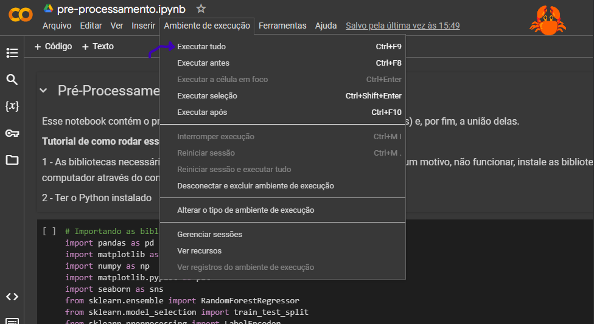
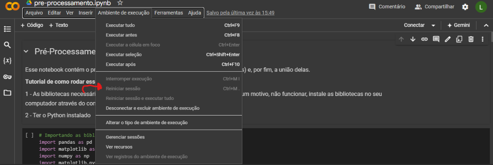
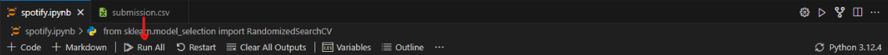
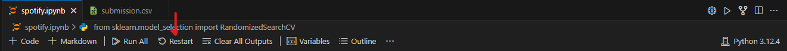
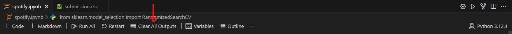

# Inteli - Instituto de Tecnologia e Liderança 

# IBM Projeto Preditivo

## Data Miners

## :student: Integrantes: 
- <a href="https://www.linkedin.com/in/calebe-matias/">Calebe Matias</a>
- <a href="https://www.linkedin.com/in/daviversan/">Davi Versan</a>
- <a href="https://www.linkedin.com/in/lucas-ramenzoni-jorge-083770302/">Lucas Ramenzoni</a> 
- <a href="https://www.linkedin.com/in/mateus-martins-pretti-03ba952b4/">Mateus Martins</a> 
- <a href="https://www.linkedin.com/in/leonardo-ogata-983b032b5/">Leonardo Ogata</a>
- <a href="https://www.linkedin.com/in/rafael-barbosa-b4386b293/">Rafael Barbosa</a> 
- <a href="https://www.linkedin.com/in/tainacortez/">Tainá Cortez</a>

## :teacher: Professores:
### Orientador(a) 
- <a href="https://www.linkedin.com/in/fabiana-martins-de-oliveira-8993b0b2/">Fabiana Martins de Oliveira</a>
### Instrutores
- <a href="https://www.escavador.com/sobre/6887412/bruna-mayer-costa#google_vignette">Bruna Mayer Costa</a> 
- <a href="https://www.linkedin.com/in/cristiano-benites-ph-d-687647a8/">Cristiano Benites</a>
- <a href="https://www.linkedin.com/in/egondaxbacher/">Egon Daxbacher</a>
- <a href="https://www.linkedin.com/in/henrique-mohallem-paiva-6854b460/">Henrique Mohallem Paiva</a> 
- <a href="https://www.linkedin.com/in/michele-bazana-de-souza-69b77763/">Michele Bazana de Souza</a> 

## 📝 Descrição

&nbsp;&nbsp;&nbsp;O projeto consiste em diversos modelos preditivos que, baseados em uma base de dados extensa que contém estatísticas das partidas, times e jogadores do Brasileirão Série A, busca predizer o que vai ocorrer em uma partida de futebol, com resultados que contemplam o placar final de uma partida, quais jogadores tem mais chances de fazer gol e qual time vai marcar primeiro. A fim de solucionar a dor reportada por nosso parceiro, a IBM, o projeto foi idealizado e feito com o propósito de apresentar essas previsões para o público médio de futebol, que assim sentem um senso maior de engajamento e curiosidade ao assistir as partidas, ultimamente enriquecendo sua experiência de visitação ao estádio. Os dados serão apresentados em dashboards interativos com visualizações claras e objetivas, permitindo a aplicação da solução em diversos outros produtos e serviços por parte do parceiro, que conseguirá além disso um diferencial competitivo no mercado esportivo ao oferecer um serviço único que pode não apenas ser integrado em estádios de futebol e potencialmente expandido para outras aplicações, mas também utilizado em previsões reais de resultados de partidas e desempenho dos jogadores. 

<a href="https://www.youtube.com/watch?v=7-XwNRufYvQ">Video de demonstração</a>

## 📁 Estrutura de pastas

Dentre os arquivos presentes na raiz do projeto, definem-se:

- <b>readme.md</b>: arquivo que serve como guia e explicação geral sobre o projeto (o mesmo que você está lendo agora).

- <b>assets</b>: todas as imagens e mídias utilizadas nos notebooks e documentação são posicionadas aqui.

- <b>documents</b>: aqui estarão todos os documentos do projeto. Há também uma pasta denominada <b>extras</b> onde estão presentes documentos complementares.

- <b>notebooks</b>: todos os Jupyter Notebooks criados para desenvolvimento do projeto.

## 💻 Execução dos projetos

### Execução do Pré-Processamento
>Para executar o pré-processamento dos dados e deixar o modelo pronto para uso, basta entrar no notebook "pre-processamento.ipynb" e clicar em "Executar tudo", desse modo o arquivo com os dados tratados será gerado. Alternativamente, para rodar tudo ao mesmo tempo  aperte as teclas ``Ctrl``  + ``F9``
>>

### Execução no Google Colaboratory
>Agora que o pré-processamento foi feito e está no mesmo ambiente que o modelo preditivo, basta abrir o notebook da previsão desejada (dentro da pasta Algoritmos) e clicar em "Executar Tudo"
>>
>
> Para **recarregar** todo o ambiente de trabalho, vá em ``Ambiente de execução`` e aperte em ``Reiniciar sessão``.
> Ou aperte as teclas ``Ctrl``  + ``M``  + ``.``  .
>>
>
>>> Para o caso do Colab, se uma cópia do notebook não for salva em seu Google Drive próprio, não será possível salvar as alterações realizadas no arquivo.

### Execução no ambiente local (Visual Studio Code)
>Novamente o notebook de pre-processamento deve ser executado previamente

>Vá para o notebook que contém a previsão que deseja fazer e clique em "Executar Tudo" como mostrado na imagem
>>  

>Para resetar todas as células, clique em "Reiniciar"
>>  

>Para limpar as saídas das células, clique em "Limpar Saídas"
>>

## 🗃 Histórico de lançamentos

* 0.5.0 - 1/10/2024
* Preparos finais do modelo
  * Documentação final
  * Otimização das previsões de acordo com as métricas de precisão

* 0.4.5 - 27/9/2024
* Comparação dos modelos
   * Construção de modelos que respondem a mesma pergunta porém com algoritmos diferentes a fim de comparação
   * Aplicação da Validação Cruzada
   * Finetuning de hiperparâmetros
   * Teste da biblioteca Pycaret e AutoML

* 0.4.0 - 25/9/2024
   * Refacção do processo de treinamento e teste
      * Treinamento dos modelos com os dados pré-processados novamente
      * Refacção doos testes com os novos dados
      * Aperfeiçoamento das métricas de desempenho para todos os modelos

* 0.3.5 - 20/9/2024
   * Refacção do pré-processamento e da análise das relações entre as features
      * Levantamento de hipóteses
      * Agrupamento de variáveis importantes
      *  Revisão do processo de treinamento
      *  Revisão de todo o processo de pré-processamento
      *  Revisão da exploração de dados
* 0.3.0 - 10/9/2024
   * Modelagem do problema e escolha de features
      * Definição das métricas de desempenho
      * Definição das features importantes e análise das relações entre elas
      * Treinamento e teste do modelo

* 0.2.5 - 5/9/2024
    * Escolha e teste dos melhores algoritmos para responder cada uma das previsões possíveis
       * Quem vai marcar gol?
          * Random Forest, Gradient Boosting e KNN
       * Qual será o placar final?
          * Random Forest, Regressão Linear e KNN
       * Qual time vai marcar o primeiro gol?
          * Random Forest e Regressão Logística
* 0.2.0 - 30/08/2024
    * Pré-processamento, exploração dos dados e formação de hipóteses
       * Levantamento das 3 hipóteses justificadas
       * Tratamento de valores nulos e outliers
       * Codificação dos dados categóricos
       * Normalização das features
       * Levantamento das estatísticas descritivas da base de dados
       * Geração de gráficos que mostram as relações entre as features
* 0.1.2 - 18/08/2024
    * Entendimento do público alvo
       * Definição de personas
       * Criação da Jornada do Usuário
* 0.1.0 - 16/08/2024
    * Entendimento do negócio:
       * Garantir conformidade com a LGPD
       * Análise SWOT
       * Análise das 5 Forças de Porter
       * Construção de uma Matriz de Risco
       * Construção de um Value Proposition Canvas
       * Análise da proposta e do problema a ser resolvido
* 0.0.1 - 05/08/2024
    * Início do projeto

## 📋 Licença/License

<a property="dct:title" rel="cc:attributionURL" href="https://github.dev/Intelihub/Template_M3">Data Miners</a> by <a rel="cc:attributionURL dct:creator" property="cc:attributionName" href="https://www.inteli.edu.br/">Inteli</a>, <a href="https://github.com/calebe-matias">Calebe Matias<a>, <a href="https://github.com/theVersan">Davi Versan</a>, <a href="https://github.com/lucasrjorge">Lucas Ramenzoni</a>, <a href="https://github.com/MateusPretti05">Mateus Martins</a>, <a href="https://github.com/mcouto0xml">- <a href="https://github.com/Leoogata">Leonardo Ogata</a>, <a href="https://github.com/RafaelBarbosa12">Rafael Barbosa</a>, <a href="https://www.linkedin.com/in/tainacortez/">Tainá Cortez</a> is licensed under <a href="http://creativecommons.org/licenses/by/4.0/?ref=chooser-v1" target="_blank" rel="license noopener noreferrer" style="display:inline-block;">Attribution 4.0 International</a>.

