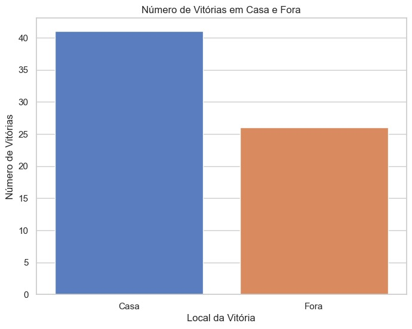
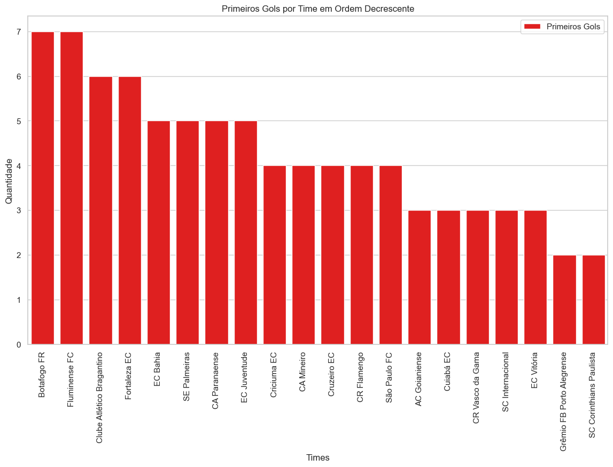

# Documentação Modelo Preditivo - Inteli

## Data Mining
### Data Miners
#### Calebe Matias, Davi Versan, Leonardo Ogata, Lucas Ramenzoni, Mateus Pretti, Rafael Barbosa, Tainá Cortez

## Sumário
[1. Introdução](#c1)

[2. Objetivos e Justificativa](#c2)

[3. Metodologia](#c3)

[4. Desenvolvimento e Resultados](#c4)

[5. Conclusões e Recomendações](#c5)

[6. Referências](#c6)

[Anexos](#attachments)


## <a name="c1"></a>1. Introdução

&nbsp;&nbsp;&nbsp; A IBM é uma fornecedora global líder em nuvem híbrida, IA e consultoria, atendendo clientes em mais de 175 países. A empresa ajuda a capitalizar insights de dados, agilizar processos e reduzir custos. Utilizada por entidades governamentais e corporativas em infraestrutura. A empresa também facilita transformações digitais de forma rápida e eficiente. As inovações da IBM em IA, computação quântica e soluções em nuvem específicas para cada indústria oferecem um grande leque de opções com compromisso, confiança e transparência.

## <a name="c2"></a>2. Objetivos e Justificativa
### 2.1 Objetivos
&nbsp;&nbsp;&nbsp;O objetivo do projeto é criar um modelo preditivo supervisionado que possa prever resultados e eventos durante partidas de futebol, para então exibir tais previsões ao público, enriquecendo a experiência do cliente e alterando a dinâmica com o estádio. Para isso devemos preparar e analisar dados históricos e em tempo real para identificar padrões e relações que alimentem o modelo preditivo, garantindo a precisão e a qualidade das previsões. <br>
<br>
&nbsp;&nbsp;&nbsp;Além disso, é muito importante assegurar uma boa experiência do usuário, por isso devemos desenvolver dashboards e visualizações interativas que permitam aos espectadores acessar as previsões de forma clara e em tempo real, melhorando a experiência dentro do estádio.

### 2.2 Proposta de solução

&nbsp;&nbsp;&nbsp;Um problema de grande relevância no mundo dos esportes está relacionado à imprevisibilidade dos resultados de partidas de futebol e à falta de outras informações e estatísticas. Esse desafio impede a elaboração de estratégias eficazes e um maior aproveitamento dos jogadores em campo. Isso torna difícil para os técnicos, analistas e jogadores antecipar os resultados de suas ações, levando a uma menor eficiência no planejamento tático e estratégico. Além disso, a falta de previsões precisas pode afetar as decisões comerciais e de gestão dos clubes, que dependem de dados confiáveis para otimizar o desempenho e a rentabilidade.

&nbsp;&nbsp;&nbsp;Com base nisso, a solução proposta se fundamenta em um modelo preditivo desenvolvido por meio de aprendizado supervisionado. Esse modelo pode ser utilizado no estádio durante partidas de futebol, oferecendo insights valiosos para estratégias de jogo e decisões comerciais, além de aumentar o engajamento com os fãs do esporte. O aprendizado supervisionado envolve a utilização de algoritmos que aprendem a partir de dados históricos, identificando padrões que podem ser aplicados a situações futuras. Dessa forma, técnicos e gestores podem receber recomendações em tempo real, melhorando a tomada de decisões e o desempenho em campo.

&nbsp;&nbsp;&nbsp;O modelo utilizará algoritmos e técnicas de modelagem específicas que, por meio da análise de dados, serão capazes de fornecer resultados preditivos sobre o desempenho em jogos. Técnicas como redes neurais, regressão logística e árvores de decisão serão implementadas para analisar um grande conjunto de dados, incluindo estatísticas de jogos passados, desempenho individual dos jogadores, classificação do time e muitos outros fatores. Espera-se que, ao final desse processo, o modelo consiga prever minimamente o resultado das partidas, os jogadores que irão marcar gols e o placar final das partidas. Essas previsões permitirão aos clubes ajustar suas táticas e se adaptar conforme o andamento dos jogos.

&nbsp;&nbsp;&nbsp;Os dados serão apresentados em dashboards interativos, com visualizações claras e objetivas. Assim, o modelo poderá ser empregado por plataformas de análise esportiva e clubes de futebol, o que poderá impactar positivamente o gerenciamento de organizações dessa área. Com dashboards interativos, será facilitada a interpretação e a aplicação das informações. Isso permitirá uma melhor compreensão das decisões que influenciam o andamento dos campeonatos, proporcionando uma vantagem competitiva significativa aos times que utilizarem o modelo.

&nbsp;&nbsp;&nbsp;Ademais, a IBM poderá se beneficiar da solução desenvolvida ao aplicá-la em conjunto com seus produtos e serviços, fortalecendo suas relações comerciais com clientes e expandindo as áreas de influência da empresa, primariamente em parcerias com clubes e instituições esportivas. Ao integrar essa tecnologia em seu portfólio, a IBM poderá oferecer soluções ainda mais robustas e personalizadas, aumentando sua presença no mercado esportivo e atraindo novos clientes. Essa estratégia não só diversifica as operações da IBM, mas também determina sua posição como líder em tecnologia aplicada ao esporte, potencializando os resultados financeiros e a visibilidade da marca.

### 2.3 Justificativa

&nbsp;&nbsp;&nbsp;Ao introduzir uma solução inovadora no setor esportivo que utiliza tecnologia avançada de IA e análise de dados, são criadas novas oportunidades de interação para os fãs de futebol, garantindo experiências e um nível de engajamento único com o esporte.
Com a solução em mãos, será possível criar um diferencial competitivo no mercado esportivo ao oferecer um serviço único que pode não apenas ser integrado em estádios de futebol e potencialmente expandido para outras aplicações e também utilizado em previsões reais de resultados de partidas e desempenho dos jogadores, como é o caso das apostas ou das negociações comerciais esportivas.
Utilizar o modelo preditivo proposto significa explorar novas fontes de receita e parcerias comerciais nunca anteriormente pensadas, como com empresas de mídia e plataformas de apostas esportivas, ao oferecer previsões precisas e valiosas durante as partidas.


## <a name="c3"></a>3. Metodologia

&nbsp;&nbsp;&nbsp;CRISP-DM [7] é uma abreviação para Cross Industry Standard for Data Mining. Essa é uma metodologia que ajuda a organizar os seus projetos de data science, transformando dados da empresa em conhecimento e informações. O CRISP surgiu pela necessidade de uma ferramenta que norteasse os profissionais a manipular um grande volume de dados.

Essa metodologia é dividida em 6 etapas, são elas:

**Entendimento do problema:** Antes de tudo, é importante realizar o entendimento do negócio, entender exatamente qual a dor a empresa está pensando em resolver e como isso impacta os investidores, colaboradores e etc. Nessa etapa verifica-se as condições gerais da empresa, como o capital necessário para o investimento está disponível ou se o projeto trará os retornos suficientes. Nesse momento que a equipe define onde ela quer chegar com a solução e, com isso, descrever o objetivo final.

**Compreensão dos dados:** Agora que a solução está desenhada, é hora de analisar os dados disponíveis. É aqui que a mineração de dados realmente começa, já que é necessário definir quais dados realmente vão ser importantes para o projeto, decifrando quais dados definem o problema e quais definem a solução. Com os dados em mãos, é possível identificar quais podem auxiliar, quais podem atrapalhar e quais não fazem sentido para o objetivo pré-pensado.

**Preparação dos dados:**  Com os dados identificados, é importante utilizar da parte técnica para a análise desse conteúdo, é nesse momento que os dados são escolhidos e é definido como eles serão cruzados para resolver o problema da empresa. Nessa etapa, toda a limpeza dos dados é feita, removendo outliers, dados nulos, criando a normalização de dados, etc. A partir disso, tudo está pronto para iniciar a programação do modelo final.

**Modelagem:** Utilizando os objetivos estabelecidos no início do projeto e os dados selecionados é possível criar análises preditivas para prever tendências do mercado. É nesse momento que é definido qual tipo de modelo será escolhido (supervisionado ou não supervisionado) e quais modelos efetivamente serão utilizados (KNN, Random Forest, K-means, entre outros).

**Avaliação:**  Essa etapa envolve a avaliação dos resultados obtidos. É necessário trazer dados e insights que demonstram o progresso da equipe com base nos objetivos já estabelecidos anteriormente. Dessa forma, é possível enxergar se o projeto deu certo ou não. Existem diversas métricas que podem ser utilizadas para medir o sucesso da aplicação, como o R², a acurácia e a porcentagem de acertos. A partir dos dados de teste separados anteriormente, o próprio modelo identifica os resultados.

**Implementação dos modelos na empresa:** É hora de colocar na prática tudo o que foi aprendido, com os dados escolhidos, minerados, tratados e provados, o modelo está pronto para ser implementado. A empresa deve pegar todo o trabalho que foi realizado e colocar em funcionamento.

&nbsp;&nbsp;&nbsp;Essa metodologia permite à empresa tomar decisões mais eficazes, uma vez que todo o planejamento é milimetricamente calculado, além de ter o cliente participando mais do processo, seja no fornecimento de dados ou nas discussões. Dessa forma, a metodologia se encaixa muito com produtos que utilizam modelo preditivo no geral, permitindo uma análise aprofundada e correções mais detalhadas, tornando o projeto mais completo para a sua utilização.


## <a name="c4"></a>4. Desenvolvimento e Resultados
### 4.1. Compreensão do Problema
#### 4.1.1. Contexto da indústria 
 
&nbsp;&nbsp;&nbsp;O mercado de modelos preditivos é dominado por grandes empresas de tecnologia, como Google Cloud AI, Microsoft Azure AI, Amazon Web Services (AWS) AI e IBM Watson. Essas gigantes da área fornecem soluções avançadas, que permitem que as organizações transformem grandes volumes de dados em insights acionáveis.

&nbsp;&nbsp;&nbsp;Os principais modelos de negócio no mercado de modelos preditivos abrangem plataformas de machine learning, marketplaces de dados e consultoria especializada em inteligência artificial e machine learning. As plataformas de machine learning fornecem uma infraestrutura robusta e escalável para o desenvolvimento e implementação de modelos. Os marketplaces de dados disponibilizam vastos conjuntos de dados de alta qualidade que são essenciais para o treinamento eficaz dos modelos. Além disso, as consultorias utilizando inteligência artificial e machine learning oferecem soluções, adaptadas às necessidades de cada cliente, o que  contribui para a potencialização dos resultados da empresa.

&nbsp;&nbsp;&nbsp;O mercado de modelos preditivos está repleto de tendências, entre elas a previsão de demanda e gestão de estoque no varejo, no qual evitando faltas ou excessos de produtos. Na área de marketing, a otimização de campanhas permite que as empresas direcionem melhor seus esforços de marketing, personalizando ofertas e mensagens para maximizar o engajamento e a conversão dos clientes. No esporte, a seleção de jovens talentos utiliza modelos preditivos para identificar atletas promissores, facilitando as decisões de times e técnicos sobre quais jogadores devem receber um maior investimento.

&nbsp;&nbsp;&nbsp; Visando um melhor entendimento da contextualização da industria foi desenvolvido um Modelo de 5 Forças de Porter. 

&nbsp;&nbsp;&nbsp; As 5 forças de Porter é um framework de análise setorial que permite entender o nível de competitividade de um mercado. Esse framework tem os seguintes pilares:

1. Poder de barganha dos fornecedores, avalia o poder de negociação que os fornecedores possuem sobre a empresa analisada. 

2. Poder de barganha dos compradores, avalia o poder de negociação que os clientes possuem sobre a empresa analisada. 

3. Rivalidade entre concorrentes, refere-se ao nível de competição entre as empresas já estabelecidas no mercado.

4. Ameaça de novos entrantes, refere-se à facilidade com que novas empresas podem entrar no mercado.

5. Ameaça de produtos substitutos, avalia o risco de produtos ou serviços alternativos que possam substituir os existentes no mercado.

&nbsp;&nbsp;&nbsp;&nbsp; No contexto da IBM, esse modelo pode ser utilizado da seguinte forma:

<div align="center" width="100%">
<sub>Figura 1 - As 5 Forças de Porter.</sub>

<sup>Fonte: Material produzido pelos autores (2024).</sup>
</div>

**Poder de barganha dos fornecedores:** Empresas nesse ramo buscam muitos fornecedores de hardware e software, bem como fornecedores de chips, armazenamento em nuvem e ferramentas de IA. Visando a sociedade atual, existem diversos negócios que atuam na distribuição desses produtos, com isso, as empresas citadas têm uma alta possibilidade de escolhas de abastecedores, tornando o poder de barganha dos fornecedores limitado.

**Poder de barganha dos compradores:** Atualmente, existem diversas empresas que se destacam no setor de IA, possuindo não só um tipo de negócio, mas vários deles. Alguns exemplos a serem citados são: IBM, Amazon, Google, entre outros. Por esse motivo, o poder de barganha dos compradores é alto, já que eles possuem muitas opções de escolha entre plataformas e serviços de inteligência artificial.

**Rivalidade entre concorrentes:** Como supracitado, muitas empresas no setor de IA oferecem serviços semelhantes e de alta qualidade, como plataformas de machine learning e modelos preditivos. Por isso, a rivalidade entre concorrentes é alta.

**Ameaça de novos entrantes:** É de senso comum que para entrar no mercado de IA e modelos preditivos é necessário um alto investimento na infraestrutura, já que o desenvolvimento de bons algoritmos e a capacidade de processar grandes volumes de dados exigem muitos recursos. A Amazon, apesar de já consolidada, planeja investir 10 bilhões de euros nos seus serviços de nuvem [3].  Dessa forma, conclui-se que existe uma enorme barreira de entrada, tornando a ameaça de novos entrantes baixa.

**Ameaça de produtos substitutos:** Quando pensamos em produtos substitutos, pensamos em produtos e/ou tecnologias que podem substituir outros de forma similar, mas não igual. Mesmo com o rápido avanço da tecnologia, é difícil imaginar uma inovação que consiga substituir completamente soluções como modelos preditivos e machine learning. Sendo assim, a ameaça de produtos substitutos é baixa.

&nbsp;&nbsp;&nbsp;&nbsp;Portanto, é notório que existem muitas empresas focadas no setor de IA, mas a IBM consegue se destacar entre elas, principalmente quando o assunto é modelo preditivo. Pensando fora do escopo da IBM, percebe-se que o setor de tecnologia, em geral, é um mercado difícil de entrar e de se estabelecer. Dessa forma, conclui-se que, para se manter nesse mercado, além dos altos investimentos, é necessária adaptação, pois uma empresa que não inova ou se atualiza perde sua relevância muito rapidamente. Assim, a IBM tem conseguido atingir os patamares esperados.

#### 4.1.2. Análise SWOT 

&nbsp;&nbsp;&nbsp; A análise SWOT é uma ferramenta estratégica de planejamento que avalia a situação de uma organização, empresa ou empreendimento, considerando suas forças e fraquezas internas, bem como as oportunidades e ameaças externas, facilitando a compreensão e a tomada de decisões.

&nbsp;&nbsp;&nbsp;  Ao realizar a análise SWOT da IBM (International Business Machines Corporation), como mostrado na figura 1, é possível identificar seus pontos fortes e fracos, além de detectar oportunidades e ameaças no ambiente externo, permitindo o desenvolvimento de estratégias de negócios.

<div align="center">
<sub>Figura 2 - Matriz Swot </sub>

<sup>Fonte: Material produzido pelos autores (2024)</sup>
</div>

##### Forças (Strengths)

- Variedade de produtos e serviços: A IBM é uma empresa bem diversificada, oferecendo uma grande variedade de produtos e serviços, como hardware, software, soluções em nuvem, entre outros. Com essa variação de produtos, a IBM consegue continuar operando em outros setores mesmo que parte do seu negócio falhar. 

- Presença global: A presença global é outra grande força da IBM, uma vez que opera em mais de 170 países e essa presença garante uma boa base de clientes e acesso a mercados em todo o mundo. Com esse alcance geográfico, a IBM consegue fortalecer sua posição competitiva e assegurar que, mesmo enfrentando dificuldades em alguma região específica, a empresa possa continuar crescendo em outras partes do mundo.

- Forte reputação e valor da marca: A IBM é uma marca mundialmente reconhecida e atrai respeito global por conta de suas tecnologias de alta qualidade. Ao construir essa marca poderosa, a empresa consegue fortalecer sua imagem e atrair mais clientes, além de investir em mercados mais emergentes, como inteligência artificial e computação quântica.

##### Fraquezas (Weaknesses)

- Soluções caras: Mesmo que a IBM ofereça tecnologias de alta qualidade, o elevado custo de seus produtos e serviços pode ser considerado uma fraqueza. Esses preços elevados podem se tornar uma barreira para determinados clientes, como pequenas e médias empresas. Além de limitar a base de clientes, o alto custo pode afetar a competitividade da empresa, aumentando a concorrência, já que a demanda por produtos mais acessíveis está em crescimento.

- Estrutura burocrática: A IBM é frequentemente vista como burocrática, o que pode representar uma fraqueza para a empresa, já que toda essa burocracia gera processos de tomada de decisão mais lentos, dificultando para a IBM acompanhar as rápidas mudanças do mercado e as novas oportunidades. Além disso, a estrutura burocrática pode aumentar os custos administrativos, impactando negativamente a competitividade da IBM em relação a empresas mais ágeis do setor.

 ##### Oportunidades (Opportunities)

- Mercado de nuvem em crescimento: A indústria de computação em nuvem está crescendo rapidamente, o que é uma grande oportunidade para a IBM, já que a empresa é considerada líder no setor por suas soluções híbridas, que integram muito bem serviços de nuvem pública e privada. O serviço em nuvem é bastante atraente para empresas que buscam uma boa segurança e infraestrutura, o que deixa o cenário favorável para a IBM expandir sua presença no mercado de nuvem.

- Transformação digital acelerada: Uma grande oportunidade para a IBM é a transformação digital acelerada, já que a empresa, por meio de suas tecnologias, como nuvem híbrida, inteligência artificial e computação quântica, tem grande potencial para liderar essa transformação. Essas oportunidades indicam um grande crescimento para a IBM na transformação dos mercados globais.

- Crescimento da receita de software: Embora o foco inicial da IBM fosse hardware, o software provou ser uma fonte mais lucrativa. A empresa pode aproveitar o crescimento na receita de software e dedicar seus recursos ao desenvolvimento de suas soluções para se tornar uma líder nessa área e aumentar sua lucratividade.

##### Ameaças (Threats)

- Grandes concorrentes: A IBM enfrenta forte concorrência no mercado de computação em nuvem de empresas como Microsoft, Amazon e Google. Essas empresas representam uma ameaça significativa para a IBM, pois possuem vantagens competitivas, em termos de recursos e inovação. 


- Mudanças tecnológicas: O ritmo acelerado das inovações tecnológicas é uma ameaça para a IBM, pois o ritmo acelerado das inovações pode tornar produtos e serviços obsoletos, exigindo que a empresa esteja constantemente atualizada com as novas tendências emergentes para acompanhar as mudanças do mercado e não ficar para trás. 

- Assim como qualquer outra empresa de tecnologia com reputação global, a IBM também está sujeita a riscos de falhas de segurança e ataques cibernéticos, que, por sua vez, podem comprometer dados sensíveis de clientes e operações internas, levando a perdas financeiras e danos à sua reputação. Com o aumento desses ataques cibernéticos, a IBM é obrigada a investir significativamente em segurança para manter a confiança de seus clientes na proteção de seus dados, evitando, assim, o risco de perder clientes e sua posição no mercado.

&nbsp;&nbsp;&nbsp;A partir da análise SWOT da IBM, é possível identificar os pontos fortes da empresa, que podem ser aprimorados, e os pontos fracos e vulnerabilidades que precisam de ajustes. Assim, a IBM pode adotar estratégias para continuar crescendo no mercado

#### 4.1.3. Planejamento Geral da Solução
Nessa seção explicamos como será o planejamento do projeto e como o grupo se propõe a atingir os objetivos definidos em conjunto com o parceiro

a) &nbsp;&nbsp;&nbsp; Os dados disponíveis se referem a arquivos em formato .csv e .xlsx que contemplam informações dos times da Série A do Campeonato brasileiro. Essas informações são baseadas no histórico de partidas, times e jogadores, e foram disponibilizadas pela própria IBM. Os arquivos podem ser acessados através do seguinte link: https://ibm.box.com/s/a5suw7hnaih8dybif2u4cvjds7sbq9if

b) &nbsp;&nbsp;&nbsp; A solução proposta é um modelo preditivo desenvolvido com aprendizado supervisionado, projetado para prever resultados de jogos de futebol. Este modelo será utilizado dentro de estádios durante as partidas, fornecendo insights valiosos para estratégias de jogo, decisões comerciais e aumentando o engajamento dos fãs. O modelo empregará técnicas de redes neurais, regressão logística e árvores de decisão para analisar grandes conjuntos de dados, incluindo estatísticas de jogos passados, desempenho individual dos jogadores e rankeamento do time. 

c) &nbsp;&nbsp;&nbsp; Para o desenvolvimento do atual projeto, será utilizado a tarefa de regressão através de um modelo supervisionado. Algoritmos de regressão funcionam com a compreensão de relação entre dados, quanto às variáveis para prever valores ou resultados, portanto, é o mecanismo ideal para uma solução de análise preditiva que busca antever estatísticas de partidas de futebol, pois trata-se de situações que dependem de muitos fatores diversos. Em resumo, a tarefa de regressão é fundamental para a previsão de valores numéricos contínuos, possibilitando a geração de estimativas precisas, algo importante para obter um modelo de elevada assertividade.

d) &nbsp;&nbsp;&nbsp; A solução proposta será destinada a clubes de futebol, técnicos e outras organizações para ajustar suas estratégias e se adaptar durante os jogos, garantindo um maior desempenho aos atletas e uma classificação mais elevada no campeonato. Além disso, torcedores também poderão se beneficiar com a tecnologia, sendo que terão acesso a informações mais detalhadas sobre as rodadas, obtendo estatísticas em tempo real e participando de forma mais aprofundada das disputas

e) &nbsp;&nbsp;&nbsp; Planeja-se que a solução proposta ofereça os seguinte benefícios: melhorar as
previsões de resultados de partidas, fornecer insights para estratégias de jogo e decisões
comerciais, e aumentar o engajamento dos fãs de futebol. Isso será feito a partir de um modelo preditivo, por meio de dados apresentados em dashboards interativos, com visualizações claras e objetivas. Assim, o modelo poderá ser empregado por plataformas de análise esportiva e clubes de futebol, o que poderá impactar positivamente o gerenciamento de organizações dessa área. Com dashboards interativos será  facilitada a interpretação e a aplicação das informações. Isso permitirá uma melhor compreensão das decisões que influenciam o andamento dos campeonatos, proporcionando uma vantagem competitiva significativa aos times que utilizarem o modelo.

f) &nbsp;&nbsp;&nbsp; Conforme discutido com o parceiro de projeto durante o workshop da semana 1, estabeleceu-se que serão utilizados como critérios de sucesso os seguintes fatores: Os resultados obtidos pelo modelo possuírem um rígido respaldo estatístico; O modelo ser suficientemente ajustado para prever um resultado genérico que possa representar o maior número de cenários prováveis (evitando o overfitting); O grupo demonstrar compreensão de que dados correlacionados não necessariamente representam causalidade; Evitar ruídos no modelo (variáveis desnecessárias ou dados saturados que podem interferir negativamente na qualidade das previsões; A metodologia utilizada resolver de fato um problema de negócio; Realizar a divisão dos arquivos em dados de treino, dados de teste e dados de validação.

#### 4.1.4. Value Proposition Canvas

&nbsp;&nbsp;&nbsp;A proposta de valor, segundo [1] e [2], consiste em uma análise do consumidor que visa compreender as dores, necessidades e desejos do cliente; dessa forma, o escopo dessa ferramenta é adequar a solução desenvolvida às demandas do público-alvo. Nesse sentido, o canvas de proposta de valor (Figura 1) é a ferramenta visual para organização da análise feita.

&nbsp;&nbsp;&nbsp;Primeiramente, faz-se uma análise do cliente a fim de adequar o projeto às suas necessidades. Nessa etapa, avaliam-se quais as suas dores (Pains), isto é, qual a causa da contratação da solução. Outro ponto a ser analisado é os ganhos (Gains) que ele adquirirão com a solução apresentada; ademais, realiza-se uma análise das tarefas (Customer Jobs) que o cliente tenta executar, mas demanda novas soluções. Em seguida, com base nas conclusões sobre o parceiro, deve-se propor uma solução em três fases: analgésicos (Pain Relievers), criadores de ganho (Gain Creators) e produtos e serviços (Products and Services). Pensando nos consumidores, os analgésicos representam como a solução aliviará as suas dores, enquanto os criadores de ganho são aspectos da solução capazes de entregar valor e, por fim, em produtos e serviços, lista-se quais são as principais entregas a serem feitas, ou seja, qual a solução proposta de forma concisa.

<div align="center">
<sub>Figura 3 - Canvas da Proposta de Valor</sub>

<sup>Fonte: Material produzido pelos autores (2024)</sup>
</div>

**Produtos e Serviços:** A nossa proposta é criar um modelo preditivo que permita melhorar a assertividade das previsões de futebol no campeonato brasileiro. Dessa forma, através de dados históricos, será criada uma ferramenta que consiga trazer dados relevantes, com maior probabilidade de acerto, para ser transmitida ao estádio.

**Trabalho do consumidor:** O objetivo deste projeto é entreter a torcida com curiosidades estatísticas sobre futebol.

**Dores:** Alguns problemas que a IBM enfrenta nessas previsões são a baixa assertividade e o tédio nos estádios

**Analgésicos:** Através das dores, podemos pensar em como remediá-las, nesse caso, podemos consertar através de previsões mais confiáveis e um maior número de dados a serem apresentados nos estádios.

**Ganhos:** A partir de um modelo preditivo consolidado, o usuário terá mais conteúdo nas transmissões e, além disso, o modelo oferecerá projeções mais confiáveis.

**Criadores de ganho:** O produto final entrega dados como forma de entretenimento, e através do maior índice de acertos, criar novas oportunidades de ganho.

&nbsp;&nbsp;&nbsp;Nesse sentido, a nossa proposta é criar um modelo preditivo que permita melhorar a assertividade de previsões de futebol no campeonato brasileiro. Esse projeto é direcionado para ser transmitido nos estádios durante uma partida de futebol, melhorando a experiência do torcedor.

#### 4.1.5. Matriz de Riscos
  
&nbsp;&nbsp;&nbsp; A matriz de risco é uma ferramenta usada em gerenciamento de projetos para avaliar a probabilidade de um evento acontecer e quais seriam os impactos. Cada risco é classificado em quadrantes de acordo com a sua gravidade, ajudando a identificar os riscos mais graves e a desenvolver estratégias para resolvê-los, assim como podemos observar na figura abaixo.

<div align="center">
<sub>Figura 4 - Matriz de Risco </sub>

<sup>Fonte: Material produzido pelos autores (2024)</sup>
</div>

<div align="center">
<sub> Quadro 1  </sub>

| Riscos                                       | Análise do Risco                                                                 | Plano de Ação                                                                 |
|-----------------------------------------------|----------------------------------------------------------------------------------|-------------------------------------------------------------------------------|
| Modelo preditivo falhar                            | Modelo não funciona bem e faz previsões incorretas.                       | Fazer testes regulares para verificar as previsões do modelo, e garantir que estejam funcionando corretamente.|
| Vazamento de dados                          |  Exposição não autorizada de informações pessoais e sensíveis.                                            | Seguir corretamente as LGPD para garantir  a proteção dos dados pessoais usados no modelo.|
| Manutenção do modelo preditivo             |Necessidade de fazer atualizações e ajustes do modelo com o passar do tempo                | Monitoramento contínuo do modelo, para evitar ajustes inesperados. |
| Dados incompletos ou inadequados                | Dados disponibilizado para o modelo são insuficientes, dificultando a identificação de um padrão para as previsões.    | Se for preciso, procurar dados adicionais para garantir bom resultado das previsões. |
| Não entendimento da proposta do projeto                   | Falta de entendimento da proposta pelo grupo, resultando em um produto que foge do objetivo final.                 |Reforçar frequentemente o objetivo final do projeto durante reuniões, garantindo que o grupo não se perca no meio de tantas ideias.    |
| Dificuldade de achar um modelo adequado |  Dificuldade de encontrar um modelo que se adeque aos padrões dos dados.                          | Estudar os modelos preditivos  e fazer testes até encontrar o modelo que melhor se adequa ao padrão de dados. |
| Má distribuição de tarefas                    |  Falta de organização na divisão de tarefas, sobrecarregando algum membro da equipe.              | Fazer um bom planejamento durante as dailys e garantir que o grupo mantenha uma boa comunicação durante as sprints. |
| Overfitting do Modelo                        | Modelo funciona bem com os dados de teste, mas com dados novos tem um desempenho ruim.                | Fazer testes regulares com novos dados, para evitar que o modelo se ajuste apenas aos dados de treinamento. |
| Underfitting do Modelo                           | Quando o modelo não entende os padrões dos dados de treinamento, e tem desempenho ruim tanto com os dados de teste quanto com os dados novos.       | Validar o modelo com vários tipos de dados, para garantir que ele capture os padrões corretamente.           |
| Não ter uma persona bem definida                            | Não ter um persona clara pode fazer o projeto seguir diferentes caminhos, comprometendo o foco.                                    | Analisar quais são os públicos-alvos e definir o quanto antes a persona principal do projeto.              |
| Falta de habilidades técnicas da equipe                 | Dificuldade dos integrantes da equipe em relação aos conteúdos necessários para desenvolver o modelo, o que pode atrasar as entregas.                 | Comprometimento dos integrantes com a realização dos autoestudos. |

<hr>

<sup>Fonte: Material produzido pelos autores (2024)</sup>
</div>

&nbsp;&nbsp;&nbsp; Ao montar a matriz de risco, é possível visualizar com clareza todas as ameaças do projeto, desde as menores até as de maior impacto e, com isso, desenvolver um plano de ação para cada risco, garantindo as chances de sucesso do projeto.


#### 4.1.6. Personas
&nbsp;&nbsp;&nbsp;Para desenvolver este projeto, foi fundamental compreender profundamente as características, necessidades e motivações dos diferentes perfis de usuários impactados pela solução. As personas apresentadas a seguir representam os principais grupos de usuários, fornecendo um panorama claro de suas expectativas e desafios, o que permite que a solução atenda de forma eficaz às suas necessidades, garantindo uma experiência de uso otimizada e personalizada.

<div align="center">
<sub>Figura 5 - Persona (Soraia) </sub>

<sup>Fonte: Material produzido pelos autores (2024)</sup>
</div>


&nbsp;&nbsp;&nbsp;Escolher Soraia como a persona principal faz total sentido, já que sua paixão pelo futebol e seu papel como professora refletem tanto o entusiasmo pelo esporte quanto o desejo de impactar de forma positiva quem está à sua volta. Isso permite que a solução proposta possa ser otimizada para atender tanto a torcedores que buscam entretenimento quanto a pessoas que desejam uma experiência mais informativa e transformadora com o futebol.


<div align="center">
<sub>Figura 6 - Persona (Márcio) </sub>

<sup>Fonte: Material produzido pelos autores (2024)</sup>
</div>


&nbsp;&nbsp;&nbsp;A escolha de Márcio como persona secundária reforça a relevância de sua visão técnica e comunicativa para a solução. Ele vai contribuir com a experiência técnica e também com a capacidade de envolver o público, tornando as análises mais compreensíveis e atraentes para uma audiência mais ampla, especialmente durante as transmissões ao vivo.


<div align="center">
<sub>Figura 7 - Persona (Rodrigo) </sub>

<sup>Fonte: Material produzido pelos autores (2024)</sup>
</div>  


&nbsp;&nbsp;&nbsp;Rodrigo foi escolhido como a persona terciária por sua experiência no futebol e seu interesse em dados, oferecendo uma perspectiva prática que pode não apenas ajudar a melhorar o desempenho pessoal, mas também fornecer sugestões valiosas para otimizar a solução com base em suas necessidades como atleta.


<div align="center">
<sub>Figura 8 - Persona (Robert) </sub>

<sup>Fonte: Material produzido pelos autores (2024)</sup>
</div>


&nbsp;&nbsp;&nbsp;Escolher Robert, um técnico de futebol, como também nossa persona terciária devido à sua experiência no esporte e interesse em inovação. Como usuário da nossa solução, ele poderá usar os insights para melhorar suas estratégias e decisões táticas, além de contribuir com sugestões baseadas em sua experiência prática no treinamento e desenvolvimento de equipes.


<div align="center">
<sub>Figura 9 - Personas </sub>

<sup>Fonte: Material produzido pelos autores (2024)</sup>
</div>  


&nbsp;&nbsp;&nbsp; A combinação de Soraia, Márcio, Rodrigo e Robert cria uma abordagem integrada que une educação, análise técnica e experiência prática no futebol. Soraia aporta paixão e impacto educacional, Márcio oferece análise inovadora, Rodrigo contribui com insights práticos como jogador, e Robert assegura aplicação estratégica no treinamento. Juntas, essas personas formam um modelo abrangente e eficaz no futebol.
#### 4.1.7. Jornadas do Usuário

&nbsp;&nbsp;&nbsp;Esta jornada do usuário descreve a experiência de Soraia, uma fã de futebol que busca uma forma mais envolvente de assistir aos jogos do Brasileirão. A jornada destaca suas frustrações ao não encontrar transmissões com recursos adicionais e a satisfação ao descobrir uma aplicação que oferece estatísticas em tempo real e interatividade, melhorando significativamente sua experiência.

&nbsp;&nbsp;&nbsp;O mapeamento da jornada identifica oportunidades para capturar o interesse de usuários, otimizar a visibilidade da aplicação, oferecer demonstrações e criar estratégias de fidelização. Compreender essa jornada ajuda a desenvolver soluções que atendam melhor às expectativas dos usuários e proporcionem uma experiência de visualização diferenciada.

<div align="center">
<sub>Figura 10 - Jornada do Usuário </sub>

<sup>Fonte: Material produzido pelos autores (2024)</sup>
</div>

&nbsp;&nbsp;&nbsp;A jornada de Soraia destaca as necessidades de fãs de futebol que buscam uma experiência mais envolvente ao assistir aos jogos. Desde a frustração inicial até a satisfação ao encontrar uma aplicação com recursos interativos, identificamos oportunidades para melhorar o engajamento e a adesão do usuário.

&nbsp;&nbsp;&nbsp;Focando em estratégias de marketing, otimização de visibilidade, e programas de fidelização, podemos alinhar o produto às expectativas dos usuários, oferecendo uma experiência de visualização mais rica e informativa. Essa jornada orienta nossas ações para garantir valor e manter o engajamento dos usuários ao longo do tempo.

#### 4.1.8 Política de Privacidade
### Informações Gerais sobre a Empresa
**Nome da Empresa:** IBM  
**Descrição da Empresa:** A IBM é uma fornecedora global líder de nuvem híbrida e IA, e consultoria especializada. Ela ajuda clientes em mais de 175 países a extrair insights a partir de seus dados, agilizar processos de negócios, reduzir custos e a ganhar a vantagem competitiva em suas indústrias. Milhares de entidades governamentais e corporativas em áreas de infraestrutura crítica, como serviços financeiros, telecomunicações e saúde, contam com a plataforma de nuvem híbrida da IBM e Red Hat OpenShift para impactar suas transformações digitais de forma rápida, eficiente e segura.

### Informações sobre o Tratamento de Dados

#### Coleta de Dados Pessoais
**Dados Coletados:**
- Informações pessoais dos jogadores: nome, nacionalidade, posição, estatísticas de desempenho (assistências, cobranças de pênalti, cartões amarelos, etc.)
- Informações sobre os jogos: data, times, local, resultado, métricas de desempenho das partidas.
- Informações sobre os times: estatísticas de 2024, métricas de desempenho.

**Fonte dos Dados:**
- Planilhas fornecidas pela IBM contendo dados históricos e de desempenho dos jogadores, times e partidas da Série A.

**Finalidade da Coleta dos Dados:**
- Desenvolver e treinar modelos preditivos para fornecer diversas probabilidades aos espectadores durante as partidas de futebol, tais como previsões de resultados, autor do primeiro gol, e placar final.

**Local de Armazenamento dos Dados:**
- Os dados serão armazenados em planilhas e arquivos .csv mantidos nos serviços de cloud do Google, seguindo boas práticas de segurança da informação, ou seja, jamais retirando dados e armazenado-os em locais não devidamente criptografados e privados.

**Período de Retenção dos Dados:**
- Os dados serão mantidos pelo período das 5 sprints (10 semanas) previstas para o desenvolvimento do projeto, após o qual não poderão mais ser acessados por parte de nossa equipe.

#### Uso de Cookies e Tecnologias Semelhantes
- **Cookies:** Não serão coletados.
- **Tecnologias Semelhantes:** Não haverá uso de tecnologias de coleta de dados de usuários além das fornecidas pela IBM via planilhas.

#### Compartilhamento dos Dados
**Com Quem os Dados São Compartilhados:**
- Parceiros e fornecedores que auxiliam na operação do sistema e no desenvolvimento do modelo preditivo.
- Subcontratados que fornecem suporte técnico e operacional.

**Agentes de Tratamento de Dados**

- Controlador: É a pessoa que toma as decisões referentes ao tratamento de dados pessoais. No contexto deste projeto, o controlador de dados é a empresa parceira, IBM. 
- Operador: É a pessoa que  que realiza o tratamento de dados pessoais em nome do Controlador. No nosso proejto, os alunos do Inteli são os operadores, que agem sob a orientação da IBM, sem tomar decisões sobre o tratamento.
- Titular: É a pessoa a quem os dados pessoais se referem. Neste projeto, os Titulares são os jogadores de futebol da Série A do Brasileirão, cujos dados estão sendo tratados.
- Encarregado (DPO - Data Protection Officer): É a pessoa indicada pelo Controlador e pelo Operador para atuar como ponto de contato entre eles.

### Medidas de Segurança
**Medidas Adotadas:**
- Criptografia de dados em trânsito e em repouso (realizado pelo serviço de cloud da Google).
- Controle de acesso rigoroso e monitoramento contínuo.
- Procedimentos de resposta a incidentes de segurança.
- Conformidade com os requisitos de segurança da LGPD.

### Direitos dos Usuários e Exercício dos Direitos
**Atendimento aos Direitos dos Usuários:**
- A IBM garante aos usuários/titulares o direito de acessar, corrigir, excluir, e solicitar a portabilidade de seus dados pessoais, conforme os artigos 18 e 19 da [LGPD](https://www.planalto.gov.br/ccivil_03/_ato2015-2018/2018/lei/L13709compilado.htm).

**Como Solicitar e Exercer Direitos:**
- Os titulares de dados podem entrar em contato com o Encarregado de Proteção de Dados (DPO) da IBM através dos canais de comunicação fornecidos abaixo.

### Contato do Encarregado de Proteção de Dados (DPO)
**Nome:** [Fabio Lima](https://www.linkedin.com/in/fabiol/)  
**Contato:** [LinkedIn do DPO](https://www.linkedin.com/in/fabiol/)
**Endereço:**  **IBM Brasil** - Paraíso - R. Tutóia, 1157

---

Essa Política de Privacidade está em conformidade com a [Lei nº 13.709, de 14 de agosto de 2018 (Lei Geral de Proteção de Dados Pessoais - LGPD)](https://www.planalto.gov.br/ccivil_03/_ato2015-2018/2018/lei/L13709compilado.htm). As medidas mencionadas garantem a proteção dos dados pessoais coletados e tratados durante o projeto, promovendo a transparência e a segurança necessárias conforme a legislação vigente.

### 4.2. Compreensão dos Dados

#### 4.2.1. Exploração de dados
&nbsp;&nbsp;&nbsp; A exploração de dados é a etapa inicial na preparação e análise de dados usando ferramentas de visualização de dados e técnicas estatísticas para descobrir padrões e relacionamentos dentro de um conjunto de dados. Ela ajuda a identificar valores discrepantes, detectar relacionamentos entre variáveis ​​e compreender a natureza dos dados, dessa forma, a exploração de dados nos permitirá extrair conclusões e hipóteses relevantes a partir dos dados fornecidos pela IBM.

&nbsp;&nbsp;&nbsp; Para a seção de Exploração de Dados, vamos estruturar a abordagem em três etapas, cobrindo a estatística descritiva, a categorização das colunas e a visualização de dados.

### 1. Estatística Descritiva Básica
&nbsp;&nbsp;&nbsp; A estatística descritiva fornece uma visão geral das características principais dos dados em cada coluna. Para cada coluna, a estatística descritiva básica inclui:

- **Contagem** (Count): Número total de valores não nulos na coluna.
- **Média** (Mean): A Soma dos valores dividido pelo número total de valores.
- **Desvio padrão** (std): Medida de dispersão dos valores em relação à média.
- **Mínimo** (Min): Menor valor na coluna.
- **Máximo** (Max): Maior valor na coluna.
- **Quartis** (25%, 50%, 75%): Dividem os dados em quatro partes, correspondendo a 25%, 50% e 75%.

&nbsp;&nbsp;&nbsp; A seguir, estão as estátisticas básicas referentes às colunas da tabela de partidas, de times e de jogadores, respectivamente, extraídas por meio da função `describe()` da biblioteca Pandas, em Python.

#### Tabela de Partidas
| Estatística | home_team_goal_count | away_team_goal_count | total_goals_at_half_time | home_team_goal_count_half_time | home_team_shots | away_team_shots | home_team_shots_on_target | away_team_shots_on_target | home_team_possession | away_team_possession |
|--------------------------------|----------------------|----------------------|--------------------------|-------------------------------|-----------------|-----------------|--------------------------|--------------------------|----------------------|----------------------|
| count                          | 380.000000           | 380.000000           | 380.000000               | 380.000000                    | 380.000000      | 380.000000      | 380.000000               | 380.000000               | 380.000000           | 380.000000           |
| mean                           | 0.318421             | 0.273684             | 0.257895                 | 0.168421                      | 2.092105        | 1.726316        | 0.610526                 | 0.484211                 | 11.663158            | 11.300000            |
| std                            | 0.776419             | 0.743551             | 0.655253                 | 0.479724                      | 5.755753        | 5.164711        | 3.117047                 | 2.907957                 | 22.865956            | 22.244136            |
| min                            | 0.000000             | 0.000000             | 0.000000                 | 0.000000                      | -1.000000       | -1.000000       | -1.000000                | -1.000000                | -1.000000            | -1.000000            |
| 25%                            | 0.000000             | 0.000000             | 0.000000                 | 0.000000                      | -1.000000       | -1.000000       | -1.000000                | -1.000000                | -1.000000            | -1.000000            |
| 50%                            | 0.000000             | 0.000000             | 0.000000                 | 0.000000                      | -1.000000       | -1.000000       | -1.000000                | -1.000000                | -1.000000            | -1.000000            |
| 75%                            | 0.000000             | 0.000000             | 0.000000                 | 0.000000                      | -1.000000       | -1.000000       | -1.000000                | -1.000000                | -1.000000            | -1.000000            |
| max                            | 5.000000             | 6.000000             | 4.000000                 | 4.000000                      | 22.000000       | 23.000000       | 14.000000                | 19.000000                | 72.000000            | 73.000000            |

#### Tabela de Jogadores
| Estatística                                | goals_overall | assists_overall | sm_minutes_played_recorded_overall | shots_on_target_total_overall | key_passes_per_game_overall | conceded_overall | goals_per_90_overall | min_per_goal_overall | key_passes_total_overall | dribbles_successful_per_game_overall | shots_on_target_per_game_overall | xg_per_game_overall | xa_per_game_overall | chances_created_per_game_overall | shot_accuraccy_percentage_overall | shot_conversion_rate_overall |
|--------------------------------------------|---------------|----------------|-----------------------------------|------------------------------|-----------------------------|------------------|----------------------|---------------------|------------------------|--------------------------------------|-------------------------------|---------------------|--------------------|-------------------------------|----------------------------------|-----------------------------|
| count                                      | 20.000000     | 20.000000      | 20.000000                         | 20.000000                     | 20.000000                    | 20.000000         | 20.000000             | 20.000000            | 20.000000             | 20.000000                               | 20.000000                        | 20.000000           | 20.000000          | 20.000000                       | 20.000000                          | 20.000000                    |
| mean                                       | 10.750000     | 7.700000       | 8040.500000                       | 35.300000                     | 0.550166                    | 110.500000        | 3.409000              | 76.879551            | 80.800000             | 0.432791                               | 6.063500                         | 0.085847            | 0.092539           | 0.0                             | 32.215902                           | 8.579261                     |
| std                                        | 3.024027      | 2.319256       | 873.749061                        | 8.291403                      | 0.081068                    | 44.335444         | 2.363213              | 27.409764            | 14.428043             | 0.105158                               | 1.443341                         | 0.019699            | 0.014010           | 0.0                             | 6.809237                            | 3.420727                     |
| min                                        | 5.000000      | 4.000000       | 6322.000000                       | 23.000000                     | 0.385217                    | 43.000000         | 0.730000              | 33.323529            | 54.000000             | 0.299167                               | 3.870000                         | 0.054167            | 0.070000           | 0.0                             | 19.054545                           | 2.005833                     |
| 25%                                        | 8.750000      | 6.000000       | 7529.000000                       | 29.500000                     | 0.521178                    | 91.750000         | 1.857500              | 56.082471            | 69.250000             | 0.341346                               | 5.350000                         | 0.071606            | 0.083578           | 0.0                             | 29.264038                           | 6.822260                     |
| 50%                                        | 11.000000     | 7.000000       | 8448.000000                       | 35.500000                     | 0.545972                    | 108.000000        | 2.715000              | 76.907452            | 81.000000             | 0.412788                               | 5.870000                         | 0.085500            | 0.090871           | 0.0                             | 32.091134                           | 7.907174                     |
| 75%                                        | 13.000000     | 8.500000       | 8741.250000                       | 40.000000                     | 0.595075                    | 131.500000        | 4.062500              | 98.362500            | 88.750000             | 0.491870                               | 6.237500                         | 0.093118            | 0.100937           | 0.0                             | 34.345667                           | 10.808219                    |
| max                                        | 16.000000     | 13.000000      | 8910.000000                       | 56.000000                     | 0.705000                    | 207.000000        | 10.440000             | 119.096774           | 104.000000            | 0.641250                               | 9.960000                         | 0.137500            | 0.131667           | 0.0                             | 48.054167                           | 15.250000                    |

#### Tabela de Times
| Estatística                         | wins_home | wins_away | draws_home | draws_away | losses_home | losses_away | goals_scored_home | goals_scored_away | goals_conceded_home | goals_conceded_away | clean_sheets_home | clean_sheets_away | first_team_to_score_count_home | first_team_to_score_count_away |
|-------------------------------------|-----------|-----------|------------|------------|-------------|-------------|-------------------|-------------------|---------------------|---------------------|-------------------|-------------------|-----------------------------|-----------------------------|
| count                               | 20.000000 | 20.000000 | 20.000000  | 20.000000  | 20.000000   | 20.000000   | 20.000000         | 20.000000         | 20.000000           | 20.000000           | 20.000000         | 20.000000         | 20.000000                      | 20.000000                      |
| mean                                | 2.050000  | 1.300000  | 1.300000   | 1.300000   | 1.300000    | 2.050000    | 6.050000          | 5.200000          | 5.200000            | 6.050000            | 1.550000          | 1.100000          | 2.700000                       | 1.550000                       |
| std                                 | 1.234376  | 1.128576  | 0.978721   | 0.978721   | 1.174286    | 1.468081    | 2.187885          | 2.966479          | 3.286335            | 2.327750            | 1.050063          | 1.020836          | 1.454575                       | 1.190975                       |
| min                                 | 0.000000  | 0.000000  | 0.000000   | 0.000000   | 0.000000    | 0.000000    | 2.000000          | 2.000000          | 1.000000            | 1.000000            | 0.000000          | 0.000000          | 1.000000                       | 0.000000                       |
| 25%                                 | 1.000000  | 0.000000  | 1.000000   | 0.750000   | 0.000000    | 1.000000    | 5.000000          | 2.000000          | 3.000000            | 4.750000            | 1.000000          | 0.000000          | 1.000000                       | 1.000000                       |
| 50%                                 | 2.000000  | 1.000000  | 1.000000   | 1.000000   | 1.000000    | 2.000000    | 5.000000          | 4.500000          | 4.000000            | 6.000000            | 2.000000          | 1.000000          | 3.000000                       | 1.500000                       |
| 75%                                 | 3.000000  | 2.000000  | 2.000000   | 2.000000   | 2.000000    | 2.250000    | 7.250000          | 8.000000          | 6.500000            | 8.000000            | 2.000000          | 2.000000          | 3.000000                       | 2.000000                       |
| max                                 | 4.000000  | 4.000000  | 3.000000   | 3.000000   | 4.000000    | 5.000000    | 10.000000         | 10.000000         | 12.000000           | 10.000000           | 3.000000          | 4.000000          | 5.000000                       | 4.000000                       |

### 2. Categorização das Colunas
&nbsp;&nbsp;&nbsp; As colunas dos dados podem ser classificadas em dois tipos principais: numéricas e categóricas. A categorização das colunas é importante para determinar o tipo de análise a ser realizada, e as visualizações mais adequadas para cada tipo de dado. A seguir, está a categorização das colunas das tabelas de times, partidas e jogadores, respectivamente, extraídas por meio do método `dtypes` da biblioteca Pandas, em Python.	

#### Tabela de Times
&nbsp;&nbsp;&nbsp; Colunas categóricas: `team_name`.

&nbsp;&nbsp;&nbsp; Colunas numéricas: `wins_home`, `wins_away`, `draws_home`, `draws_away`, `losses_home`,
       `losses_away`, `goals_scored_home`, `goals_scored_away`,
       `goals_conceded_home`, `goals_conceded_away`, `clean_sheets_home`,
       `clean_sheets_away`, `first_team_to_score_count_home`,
       `first_team_to_score_count_away`.
#### Tabela de Partidas
&nbsp;&nbsp;&nbsp; Colunas categóricas: `date_GMT`, `status`, `home_team_name`, `away_team_name`, `home_team_goal_timings`, `away_team_goal_timings`.

&nbsp;&nbsp;&nbsp; Colunas numéricas: `home_team_goal_count`, `away_team_goal_count`,
       `total_goals_at_half_time`, `home_team_goal_count_half_time`,
       `home_team_shots`, `away_team_shots`, `home_team_shots_on_target`,
       `away_team_shots_on_target`, `home_team_possession`,
       `away_team_possession`.
#### Tabela de Jogadores
&nbsp;&nbsp;&nbsp; Colunas categóricas: `team_name`.

&nbsp;&nbsp;&nbsp; Colunas numéricas: `goals_overall`, `assists_overall`,
       `sm_minutes_played_recorded_overall`, `shots_on_target_total_overall`,
       `key_passes_per_game_overall`, `conceded_overall`,
       `goals_per_90_overall`, `min_per_goal_overall`,
       `key_passes_total_overall`, `dribbles_successful_per_game_overall`,
       `shots_on_target_per_game_overall`, `xg_per_game_overall`,
       `xa_per_game_overall`, `chances_created_per_game_overall`,
       `shot_accuraccy_percentage_overall`, `shot_conversion_rate_overall`.

### 3. Visualização de Dados
&nbsp;&nbsp;&nbsp; A visualização de dados nos permite observar graficamente as relações entre colunas, estabelecendo um entendimento mais profundo dos dados presentes nas tabelas. Três gráficos serão utilizados para representar relações entre colunas escolhidas pelo grupo:

##### Gráfico de Dispersão (Scatter Plot):

&nbsp;&nbsp;&nbsp; Útil para visualizar a relação entre duas colunas numéricas.
Por exemplo, pode-se usar, um gráfico de dispersão para analisar a relação entre "idade" e "salário".
##### Gráfico de Barras (Bar Plot):

&nbsp;&nbsp;&nbsp; Ideal para comparar categorias entre colunas categóricas e numéricas.
&nbsp;&nbsp;&nbsp; Pode ser usado para visualizar a distribuição de uma variável categórica como "departamento", e sua relação com "salário médio".
###### Histograma:
&nbsp;&nbsp;&nbsp; Usado para observar a distribuição de uma única coluna numérica.
Um histograma da coluna "idade" pode mostrar como os valores de idade estão distribuídos no dataset.

&nbsp;&nbsp;&nbsp; A seguir, estão dispostos os gráficos que julgamos serem mais relevantes para a análise dos dados, considerando as colunas das tabelas de partidas, times e jogadores.

#### Gráfico de Barras (Relação entre gols marcados em casa e fora de casa)


&nbsp;&nbsp;&nbsp; Esta tabela exibe dados da tabela de partidas, mostrando a relação entre gols marcados em casa e fora de casa.

#### Histograma (Frequência de Primeiros Times a Marcar Gol)


&nbsp;&nbsp;&nbsp; Este histograma exibe a frequência de times que marcam o primeiro gol em partidas da Série A.

#### Gráfico de Dispersão (Relação entre gols marcados e gols sofridos)


&nbsp;&nbsp;&nbsp; Este gráfico de dispersão exibe a relação entre gols marcados e gols sofridos pelos times da Série A.

&nbsp;&nbsp;&nbsp; A partir da geração de gráficos e da análise das tabelas, a etapa de exploração nos permitiu compreender melhor a estrutura e as características dos dados fornecidos pela IBM, identificando padrões e relações relevantes para a análise e visualização dos dados. A partir dessas informações, podemos avançar para o pré-processamento, no qual realizaremos a limpeza, o tratamento e a transformação dos dados para prepará-los para a modelagem preditiva.

#### 4.2.2. Pré-processamento dos dados
&nbsp;&nbsp;&nbsp;O pré-processamento de dados é uma etapa fundamental na análise de dados e aprendizado de máquina, pois envolve a preparação e transformação de dados para torná-los prontos para análise. Esse processo inclui tarefas como limpeza de dados para inconsistências, tratamento de valores ausentes, normalização e padronização de dados para garantir que diferentes variáveis estejam na mesma escala, e a transformação de dados categóricos em formatos numéricos que podem ser interpretados por algoritmos. O objetivo do pré-processamento é melhorar a qualidade dos dados, garantindo que as análises ou modelos preditivos desenvolvidos a partir deles sejam precisos e confiáveis.

&nbsp;&nbsp;&nbsp;Em nosso projeto fizemos o pré-processamento dos dados das três tabelas que utilizaremos para a criação do nosso algoritmo de machine learning. A seguir está a explicação do tratamento de cada uma das tabelas.

**Tabela Times** <br>
&nbsp;&nbsp;&nbsp;Para a tabela com as estatísticas dos times do campeonato Brasileiro Serie A, primeiramente foi feita a seleção das colunas que serão utilizadas para a criação do modelo preditivo, as quais foram definidas pela equipe.

```
colunas_teams = teams_df[['common_name', 'wins_home', 'wins_away', 'draws_home', 'draws_away', 'losses_home', 'losses_away', 'goals_scored_home', 'goals_scored_away', 'goals_conceded_home', 'goals_conceded_away', 'clean_sheets_home', 'clean_sheets_away', 'first_team_to_score_count_home', 'first_team_to_score_count_away']]
```
&nbsp;&nbsp;&nbsp; Após isso, as colunas foram analisadas e observamos que o único dado que havia de ser tratado, por agora, estava relacionado à coluna com os nomes dos times do campeonato, pois esta possuía dados categóricos, os quais não podem ser lidos pelo algoritmo. Devido a isso, fizemos a transformação destes para dados numéricos, como mostrado no código a seguir:
```
#Transformando coluna categórica em uma coluna numérica
label_encoder = LabelEncoder()
colunas_teams['common_name_encoded'] = label_encoder.fit_transform(colunas_teams['common_name'])
```
&nbsp;&nbsp;&nbsp; Com o tratamento da tabela concluído, os dados processados serão testados em nosso algoritmo para analisar os resultados obtidos. Caso necessário, faremos os ajustes adicionais aos dados.

**Tabela Matches** <br>
&nbsp;&nbsp;&nbsp; A tabela 'matches' contém estatísticas de partidas do Campeonato Brasileiro Série A de 2024. Para começar o pré-processamento de dados dessa tabela, nossa equipe definiu quais colunas serão utilizadas na criação do modelo preditivo.

```
# Carregando o arquivo colunas-matches
matches_df = pd.read_csv('colunas-matches.csv')

# Selecionando as colunas relevantes
colunas_matches = matches_df[['date_GMT', 'status', 'home_team_name', 'away_team_name', 'home_team_goal_count', 'away_team_goal_count', 'total_goals_at_half_time', 'home_team_goal_count_half_time', 'home_team_goal_timings', 'away_team_goal_timings', 'home_team_shots', 'away_team_shots', 'home_team_shots_on_target', 'away_team_shots_on_target', 'home_team_possession', 'away_team_possession']]

```

&nbsp;&nbsp;&nbsp; Como a tabela 'matches' continha muitos jogos do campeonato que não haviam acontecido, foi feita uma filtragem para utilizar apenas os jogos completos, removendo os incompletos ou suspensos.
```
# Filtrando jogos com status "complete"
colunas_matches=colunas_matches[colunas_matches['status']=='complete']
```
&nbsp;&nbsp;&nbsp;Em seguida, as colunas com valores ausentes foram identificadas e esses valores foram substituídos por NaN para evitar erros no modelo preditivo futuramente.
```
# Verificando a quantidade de valores nulos em cada coluna
missing_values=colunas_matches.isnull().sum()

# Exibindo as colunas que possuem valores nulos e a quantidade de nulos
print(missing_values[missing_values > 0])

# Substituir valores ausentes por NaN em colunas específicas
colunas_matches['home_team_goal_timings']=colunas_matches['home_team_goal_timings'].filln(np.nan)
colunas_matches['away_team_goal_timings']=colunas_matches['away_team_goal_timings'].filln(np.nan)
```
&nbsp;&nbsp;&nbsp;Após isso, foi feito o tratamento de outliers, utilizando IQR (medida de dispersão que indica a diferença entre o terceiro quartil e o primeiro quartil dos dados, ajudando a detectar valores extremos que se afastam da distribuição central).
```
# Definindo uma função para identificar outliers usando o IQR para todas as colunas
def identificar_outliers_todas_colunas(df):
    outliers_dict = {}
    for coluna in df.select_dtypes(include=[np.number]).columns:
        Q1 = df[coluna].quantile(0.25)
        Q3 = df[coluna].quantile(0.75)
        IQR = Q3 - Q1
        outliers=df[(df[coluna]<(Q1-1.5*IQR))|(df[coluna]>(Q3 + 1.5 * IQR))]
        outliers_dict[coluna] = outliers
    return outliers_dict

# Aplicando a função ao DataFrame completo
outliers_dict = identificar_outliers_todas_colunas(colunas_matches)
```
&nbsp;&nbsp;&nbsp;Ao identificar as colunas com outliers, realizamos o tratamento substituindo esses valores pela mediana da coluna. A forma como tratamos os outliers está sujeita a mudanças, pois ainda faremos testes com o modelo preditivo.
```
# Função para identificar e substituir outliers por mediana
def substituir_outliers_por_mediana(colunas_matches):
    for coluna in colunas_matches.select_dtypes(include=[np.number]).columns:
        Q1 = colunas_matches[coluna].quantile(0.25)
        Q3 = colunas_matches[coluna].quantile(0.75)
        IQR = Q3 - Q1
        lim_inferior = Q1 - 1.5 * IQR
        lim_superior = Q3 + 1.5 * IQR
        
        # Mediana da coluna
        mediana = colunas_matches[coluna].median()
        
        # Substituir outliers por mediana
        colunas_matches[coluna] = np.where((colunas_matches[coluna] < lim_inferior) | (colunas_matches[coluna] > lim_superior), mediana, colunas_matches[coluna])

# Aplicando a função ao DataFrame filtrado
substituir_outliers_por_mediana(colunas_matches)
```
&nbsp;&nbsp;&nbsp; Posteriormente, identificamos quais colunas dentre as selecionadas eram categóricas, para transformá-las em numéricas. Com o código abaixo, foi possível identificar as colunas 'date_GMT', 'status', 'home_team_name', 'away_team_name', 'home_team_goal_timings' e 'away_team_goal_timings' como categóricas, e então tratamos cada uma delas.
```
# Identificando colunas categóricas
colunas_categoricas = colunas_matches.select_dtypes(include=['object']).columns

# Exibindo as colunas categóricas identificadas
print("Colunas categóricas:", colunas_categoricas)
```
&nbsp;&nbsp;&nbsp; Decidimos remover a coluna 'status' porque, depois de excluir os jogos cancelados e suspensos, só restaram linhas com o valor 'complete'. Com isso, foi mais prático apagar essa coluna.
```
# Removendo a coluna 'status', já que agora só tem os jogos completos.
colunas_matches=colunas_matches.drop(columns=['status'])
```
&nbsp;&nbsp;&nbsp; As colunas categóricas 'home_team_name' e 'away_team_name' foram transformadas em numéricas com base na tabela 'teams'. Dessa forma, se futuramente o modelo preditivo precisar cruzar as duas tabelas, os times poderão ser identificados facilmente em ambas.
```
# Dicionário de mapeamento para os times
team_mapping = {
    'Atlético GO': 0, 'Atlético Mineiro': 1, 'Atlético PR': 2, 'Bahia': 3, 'Botafogo': 4,
    'Bragantino': 5, 'Corinthians': 6, 'Criciúma': 7, 'Cruzeiro': 8, 'Cuiabá': 9,
    'Flamengo': 10, 'Fluminense': 11, 'Fortaleza': 12, 'Grêmio': 13, 'Internacional': 14,
    'Juventude': 15, 'Palmeiras': 16, 'São Paulo': 17, 'Vasco da Gama': 18, 'Vitória': 19
}

# Aplicando o mapeamento às colunas 'home_team_name' e 'away_team_name'
colunas_matches['home_team_name']=colunas_matches['home_team_name'].replace(team_mapping)
colunas_matches['away_team_name']=colunas_matches['away_team_name'].replace(team_mapping)
```

&nbsp;&nbsp;&nbsp;A coluna categórica 'date_GMT' foi transformada em duas colunas numéricas, que representam apenas o dia e o mês da partida. Informações como o ano e a hora foram descartadas, pois a equipe não considerou importantes para o modelo.
```
# Convertendo a coluna 'date_GMT' para datetime
colunas_matches['date_GMT'] = pd.to_datetime(colunas_matches['date_GMT'], format='%b %d %Y - %I:%M%p')

# Extraindo componentes individuais
colunas_matches['month']=colunas_matches['date_GMT'].dt.month
colunas_matches['day']=colunas_matches['date_GMT'].dt.day

# Removendo a coluna 'date_GMT', já que agora temos colunas para dia e mês.
colunas_matches=colunas_matches.drop(columns=['date_GMT'])
```
&nbsp;&nbsp;&nbsp; Para transformar as colunas 'home_team_goal_timings' e 'away_team_goal_timings' em numéricas, optamos por considerar apenas o tempo do primeiro gol, que é o mais relevante para nosso modelo preditivo. Assim, criamos as colunas 'home_team_first_goal' e 'away_team_first_goal' no lugar das originais
```
# Função para pegar o minuto do primeiro gol
def primeiro_gol(minutos):
    if pd.isna(minutos):
        return np.nan  # Mantém NaN se os minutos forem nulos

    # Divide a string em uma lista, ignorando espaços e apostrofos
    minutos = [m.split("'")[0].strip() for m in str(minutos).split(',') if m]

    # Filtra apenas valores que podem ser convertidos para inteiros
    try:
        minutos = [int(m) for m in minutos if m.isdigit()]
    except ValueError:
        return np.nan  # Retorna NaN se houver erro na conversão
    
    if not minutos:
        return np.nan  # Retorna NaN se a lista estiver vazia
    
    # Retorna o primeiro valor da lista ordenada
    return sorted(minutos)[0]

# Aplicando a função para o primeiro gol
colunas_matches['home_team_first_goal']=colunas_matches['home_team_goal_timings'].apply(primeiro_gol)
colunas_matches['away_team_first_goal']=colunas_matches['away_team_goal_timings'].apply(primeiro_gol)

# Removendo a coluna 'home_team_goal_timings' e 'away_team_goal_timings', já que agora temos coluna só do tempo do primeiro gol.
colunas_matches=colunas_matches.drop(columns=['home_team_goal_timings', 'away_team_goal_timings'])
```
&nbsp;&nbsp;&nbsp;Por fim, aplicamos a normalização z-score nas colunas numéricas, que ajusta os dados para terem média zero e desvio padrão um. Vale lembrar que essa normalização pode ser alterada depois, já que dependendo do algoritmo usado no modelo preditivo, essa pode não ser a melhor abordagem.
```
from sklearn.preprocessing import StandardScaler

# Inicializando o StandardScaler
scaler = StandardScaler()

# Selecionando as colunas para normalização
colunas_para_normalizar = ['home_team_goal_count', 'away_team_goal_count', 'total_goals_at_half_time', 
'home_team_goal_count_half_time', 'home_team_shots', 'away_team_shots', 
'home_team_shots_on_target', 'away_team_shots_on_target', 
'home_team_possession', 'away_team_possession']

# Aplicando a normalização Z-Score
colunas_matches[colunas_para_normalizar] = scaler.fit_transform(colunas_matches[colunas_para_normalizar])
```
&nbsp;&nbsp;&nbsp; Após concluir a normalização das colunas numéricas, o pré-processamento dos dados na tabela matches está finalizado. No entanto, durante a fase de teste do modelo preditivo e dos algoritmos, pode ser necessário ajustar o pré-processamento para melhorar o desempenho do modelo.


#### 4.2.3. Hipóteses
&nbsp;&nbsp;&nbsp;Ao longo das etapas de exploração e pré-processamento de dados, é necessário a formulação de hipóteses para direcionar o tratamento dessas informações, as quais nada mais são que suposições ou afirmações que podem ser testadas para determinar sua validação. A seguir encontram-se algumas hipóteses elaboradas pelo grupo Data Miners com o objetivo de obter um panorama mais específico de como as variáveis se relacionam, quais são seus efeitos nos resultados e as features mais relevantes para o treinamento do modelo.

**Hipótese 1:** Jogos disputados em casa têm uma maior probabilidade de terminar com vitória para o time da casa.

&nbsp;&nbsp;&nbsp;Para testar essa hipótese, nós comparamos o número de vitórias para times jogando fora de casa com o número de vitórias obtidas pelo time que estava jogando em casa.

<div align="center">
<sub>Figura 9 - Gráfico de barras hipótese 1 - Número de gols dentro e fora de casa </sub>

 
<sup>Fonte: Material produzido pelos autores (2024)</sup>
</div>  

&nbsp;&nbsp;&nbsp;Conforme o gráfico de barras acima, é comprovado que os times que jogam em casa tendem a vencer mais do que os times que jogam fora, visto que o time da casa tem 41 vitórias no campeonato e o time de fora tem 26. Logo, a hipótese se mostra  verdadeira. A partir disso, é determinado que a tabela que indica qual time joga em casa é muito importante para aumentarmos a precisão do modelo, por isso, ela foi escolhida para testar o modelo.

**Hipótese 2:** Times com mais gols no campeonato tendem a marcar o primeiro gol

&nbsp;&nbsp;&nbsp;Para testar essa hipótese, primeiramente produzimos um gráfico de barras que mostra o total de gols marcados por cada time no campeonato em ordem decrescente. Em seguida nós criamos um gráfico de barras que demonstra a quantidade de ‘primeiros gols da partida’ marcados por cada time do campeonato:

<div align="center">
<sub>Figura 10 - Gráfico de barras hipótese 2 - Total de gols</sub>

<sup>Fonte: Material produzido pelos autores (2024)</sup>
</div>  

<div align="center">
<sub>Figura 11 - Gráfico de barras hipótese 2 - Primeiros gols</sub>

<sup>Fonte: Material produzido pelos autores (2024)</sup>
</div>  

&nbsp;&nbsp;&nbsp;A partir da análise de ambos os gráficos, chegamos a conclusão de que existe uma relação entre o fato de um time marcar o primeiro gol e esse time ter uma grande quantidade de gols acumulados no campeonato, como no caso do Botafogo, localizado na primeira posição nos dois casos.  Entretanto, temos times como o fluminense ou flamengo que fogem dessa lógica, cujas posições em um gráfico não correspondem aos resultados do outro.  Portanto, essa hipótese não está 100% correta, mas pode ser usada como um direcionamento para análises mais aprofundadas.

**Hipótese 3:** Quanto mais cartões o time de fora toma, mais chances o time da casa tem de ganhar. 

&nbsp;&nbsp;&nbsp;Para testar a validade dessa hipótese, criamos gráficos que mostram qual time leva mais cartões (o time da casa ou o time de fora) e verifica qual deles tem uma maior taxa de vitórias. 

<div align="center">
<sub>Figura 12 - Gráfico de barras hipótese 3 - número de cartões </sub>

 
<sup>Fonte: Material produzido pelos autores (2024)</sup>
</div>  

<div align="center">
<sub>Figura 13 - Gráfico de barras hipótese 3 - Número de gols dentro e fora de casa </sub>

 
<sup>Fonte: Material produzido pelos autores (2024)</sup>
</div>  

&nbsp;&nbsp;&nbsp;A partir do primeiro gráfico percebemos que os times jogando fora de casa recebem mais cartões que os times que jogam em casa na maioria das partidas. Com o segundo gráfico observamos que o time da casa tende a ter o maior número de vitórias

&nbsp;&nbsp;&nbsp;Levando em conta os gráficos acima, comprovamos que o time de fora costuma levar mais cartões e, ao mesmo tempo, perder mais partidas. Isso não prova que há uma relação causal entre o número de cartões recebidos pelo time de fora e uma chance maior de o time de casa ganhar, mas demonstra que o time que leva menos cartões tende a terminar a partida com a vitória. Com isso, concluímos que levar em conta essa variável não é fundamental, mas pode auxiliar a incrementar credibilidade ao modelo.

&nbsp;&nbsp;&nbsp;Através dessas hipóteses supracitadas, conseguimos avaliar quais colunas realmente são importantes para a entrega de um bom projeto final e quais que não agregam tanto assim. Com isso, é interessante que o grupo explorasse mais colunas e criasse novas hipóteses para novos testes, visto que isso acarretará em maiores taxas de acerto da aplicação.

### 4.3. Preparação dos Dados e Modelagem

#### 4.3.1 Organização dos dados
&emsp;A preparação e modelagem dos dados são etapas fundamentais na construção de modelos preditivos. Esses processos transformam dados brutos em informações organizadas, possibilitando a identificação de relações e a tomada de decisões justificadas.

&emsp;Após analisar as opções disponíveis, definimos que utilizaremos um modelo supervisionado para o desenvolvimento do projeto. O aprendizado supervisionado se utiliza do emprego de conjuntos de dados rotulados para treinar algoritmos de classificação ou regressão. Esses dados que rotulamos como "treinamento" são inseridos no modelo, o qual os ajusta iterativamente sua avaliação das diferentes características até alcançar os resultados esperados.

&emsp;Optamos pelo modelo de regressão Random Forest, o qual, se utiliza de subconjuntos de dados para criar árvores de decisão. Nesse algoritmo, variáveis aleatórias são selecionadas e percorrem um 'caminho' semelhante a de um fluxograma. Este, tem o objetivo específico de atingir uma classificação específica, a qual responda ao problema apresentado, ou, hipóteses levantadas.  

&emsp;Cada classificação atribuída a uma variável contribui com um 'peso' para a decisão final, que será o objetivo de previsão do modelo. Para que isso aconteça, dividimos nosso conjunto de dados em 80% para o treinamento e 20% para os testes, com o objetivo de prever o placar final de uma partida de futebol. Além disso, estabelecemos a criação de 100 árvores de decisão para garantir maior precisão nos resultados. As colunas utilizadas estão especificadas no trecho de código abaixo:

```python

import pandas as pd
from sklearn.model_selection import train_test_split
from sklearn.ensemble import RandomForestRegressor
from sklearn.metrics import mean_squared_error
import matplotlib.pyplot as plt
import seaborn as sns

df_final = df_final.fillna(0)

# Definir X e y
X = df_final[['home_team_name', 'away_team_name', 'total_goal_count', 'goals_scored_home', 'goals_scored_away', 'goals_conceded_home', 'goals_conceded_away', 'home_ppg', 'home_team_goal_count_half_time']]

y_gols_casa = df_final['home_team_goal_count']
y_gols_fora = df_final['away_team_goal_count']

# Divisão dos dados
X_train, X_test, y_train_casa, y_test_casa = train_test_split(X, y_gols_casa, test_size=0.2, random_state=42)
X_train, X_test, y_train_fora, y_test_fora = train_test_split(X, y_gols_fora, test_size=0.2, random_state=42)

# Treinamento dos modelos
model_casa = RandomForestRegressor(n_estimators=100, random_state=42)
model_fora = RandomForestRegressor(n_estimators=100, random_state=42)
```
&emsp;Como dito anteriormente, o conjunto de dados utilizado em nosso modelo foi dividido em 80% para treino, ou seja, a maior parte dos dados é usada para “ensinar” o modelo, de forma que o mesmo aprenda os padrões presentes no conjunto de dados. Os outros 20% são usados para testes, etapa em que utilizamos dados que ainda não foram explorados pelo modelo preditivo, a fim de uma verificação da conformidade da modelagem, de forma a garantir que o modelo seja capaz de generalizar seu aprendizado para dados novos.

&emsp;Essa generalização para dados novos evita o _overfitting_, que é um fenômeno que occore quando o modelo se ajusta excessivamente aos dados de treinamento de forma que não consegue fazer previsões corretas para novos dados. Portanto, a etapa de teste é muito importante para garantir que o modelo tenha aprendido os padrões dos dados de treinamento e consiga usar esse aprendizado para fazer previsões em situações reais.

&emsp;Por exemplo (ou ainda, como visto…), no trecho de código no tópico conjunto de treinamento é possível perceber que a divisão dos dados foi realizada por meio da função ‘train_test_split’ da biblioteca Scikit-Learn. As variáveis preditoras (X) foram definidas a partir de colunas que consideramos importantes para prever o placar final do jogo, enquanto as variáveis alvo (y) são as colunas que indicam os gols marcados pelo time da casa e pelo time visitante em uma partida. Dessa forma, usamos o parâmetro ‘test_size=0.2’ para separar os dados em 80% para treino e 20% para teste, e o parâmetro ‘random_state=42’ para garantir que a mesma amostra seja utilizada a cada vez que o código é executado.

&emsp;Desse modo, fica claro que utilizando um agrupamento de teste/treino não enviesado e generalizado, que conta com dados capazes de garantir ao nosso modelo condições de se ajustar à diferentes padrões de treino e, consequentemente, diversas situações reais, evitando o _overfitting_, podemos ter uma noção de como esses dados vão de fato impactar no funcionamento do modelo preditivo.

&emsp;Já, ao utilizarmos um conjunto de dados aleatórios para treino, pudemos evitar que o nosso modelo sofresse de _overfitting_. Sendo este modelo, capaz de realizar previsões sobre o placar de uma partida, sem se importar com a especificidade dos dados, ou, com o modo com que eles se encaixam em seu treinamento, se tornando assim um modelo preditivo adaptável. 

&emsp;Conteúdo, ao mesmo tempo que nosso conjunto de dados utilizado para treino contribui para essa característica ‘ajustável’ do modelo, treinar exclusivamente com dados aleatórios também traz à nossa previsão um caráter de exclusão, pois, conjuntos inteiros de dados, como informações de um time inteiro, por exemplo, podem ficar de fora, possivelmente enviesando nosso modelo para que dessa vez nunca consiga chegar no placar correto desse time específico. 

&emsp;Agora que sabemos o que esperar de um conjunto de dados de treino e teste separados aleatoriamente, que evita o viés e a especificidade do overfitting, mas, ao mesmo tempo traz o risco de excluir algumas informações, podemos realizar a comparação daquilo que realmente impactou o funcionamento do modelo a partir desse treino. A partir do resultado do modelo que prevê o placar das partidas, podemos ver que o overfitting não é um problema, e que o propósito do treinamento aleatório foi cumprido como esperado. Ademais, não temos evidências de que alguma parte crucial dos dados disponíveis foi excluída do treino.

&emsp;De qualquer forma, não podemos ter certeza de que não prejudicamos indiretamente o modelo preditivo ao selecionar dados de treino aleatórios. Portanto, para assegurarmos que as previsões ocorram como esperadas, filtrar algumas informações necessárias para o treinamento do modelo e retirar outras desnecessárias será uma etapa importante para a progressão e o andamento do projeto daqui em diante.

#### 4.3.2 Modelagem para o problema

&nbsp;&nbsp;&nbsp;Haviam 5 tabelas disponíveis para a análise (Matches, Players, Teams1, Teams2 e league), pensando nos objetivos finais do grupo ([explicados anteriormente](#c2)), escolhemos as tabelas que mais ajudariam no funcionamento do modelo. No caso do modelo que prevê o placar da partida, usaremos a Matches e a Teams1, e, para o modelo que diz quem vai marcar gol, a tabela Players. Entendendo os outros objetivos, o grupo percebeu que essas 3 tabelas seriam suficientes.

Antes de escolher as features que iríamos usar, decidimos quais não usar.

*As colunas com dados irrelevantes são:* 
   
    aerial_duels_per_game_overall: Todos os dados são 0
    possession_regained_per_90_overall: Todos os dados são 0
    possession_regained_total_overall: Todos os dados são 0
    season: Todos os dados são 2024

&nbsp;&nbsp;&nbsp;Muitas outras colunas seguiam o padrão da explicação acima, assim, todas elas foram removidas. Além dessas já removidas, o grupo buscou classificar manualmente outras que de acordo com consenso da equipe, não acrescentariam ao projeto, seguem alguns exemplos:

    referee: O juiz não afeta o resultado da partida
    birthday: O aniversário do jogador não afeta sua performance
    stadium_name: Já sabemos se o time está jogando em casa ou não, dessa forma, o nome do estádio é irrelevante.

&nbsp;&nbsp;&nbsp;A partir dessa análise humana, podemos utilizar as máquinas para selecionar as features que realmente vamos usar. O primeiro passo foi montar um gráfico (Figura 14) que aponta as colunas que mais impactam. Este pode ser visualizado abaixo:

<div align="center">
<sub>Figura 14 - Gráfico das features mais importantes </sub>

 
<sup>Fonte: Material produzido pelos autores (2024)</sup>
</div>  

&nbsp;&nbsp;&nbsp;Através dessa análise, colocamos todas as principais variáveis no nosso modelo. Entretanto, alguns resultados inesperados aconteceram. O total_goal_count, por exemplo, estava influenciando muito no modelo, mas não de forma positiva. Pelo enorme número de 0 contidos nesta coluna, o modelo começava a prever mais 0 a 0 quando utilizamos essa variável. Com isso, o grupo notou a necessidade de reorganizar as tabelas para eliminar os dados nulos e, dessa forma, refazer esse gráfico e utilizá-lo futuramente. 

&nbsp;&nbsp;&nbsp;Visando criar um modelo que preveja placares reais, removemos essa variável e outras que agiam de forma parecida. E assim, a escolha das variáveis foi realizada manualmente Deu-se da seguinte maneira, elecionávamos novas colunas, colocávamos no modelo, observávamos e  o resultado obtido, e, quando as métricas melhoravam sua performance, optávamos por manter aquela coluna, já quando a mesma enviesava o modelo, a removíamos. Dessa maneira, foram escolhidas as colunas de treinamento do modelo, Algumas delas são:

      home_team_name: nome do time da casa
      away_team_name: nome do time de fora
      goals_scored_home: gols marcados em casa
      goals_scored_away: gols marcado fora
      goals_conceded_home: gols feitos em casa
      goals_conceded_away: gols feitos fora

&nbsp;&nbsp;&nbsp;Quando implementávamos novas features, plotávamos gráficos para ver o quanto aquela variável estava ajudando ou atrapalhando o modelo. Seguem:(Figura 15, Figura 16)

<div align="center">
<sub>Figura 15 - Gráfico das features home </sub>

 
<sup>Fonte: Material produzido pelos autores (2024)</sup>
</div>  

<div align="center">
<sub>Figura 16 - Gráfico das features away </sub>

 
<sup>Fonte: Material produzido pelos autores (2024)</sup>
</div>  

&nbsp;&nbsp;&nbsp;Foi a partir dessas análises que o grupo definiu se a variável seria mantida ou descartada. Features que tinham muito destaque foram removidas, assim como as com pouco destaque. Dessa forma, concluímos que nossos métodos de seleção de features são bons, mas os nossos dados não foram tratados de maneira adequada. Por  esse motivo, há a necessidade de remover features que se destacam muito. Com os dados pré-processados corretamente, a seleção será aprimorada, o que trará ótimos resultados para o modelo final.

&nbsp;&nbsp;&nbsp;Após o estudo sobre algoritmos de machine learning, entendemos que existem dois tipos de modelo, o supervisionado e o não-supervisionado, ou seja, a diferença de um para o outro é a de que um não precisa de supervisão humana e o outro precisa. Tendo em vista os nossos dados e os nossos objetivos, definimos que nosso modelo precisa ser testado e avaliado por humanos, portanto, ele deve ser do tipo supervisionado. Além do mais, nosso grupo através de pesquisas definiu que o melhor modelo para a nossa situação seria o Random Forest. O motivo da escolha foi  o fato de que ele seleciona as colunas de treinamento de forma aleatória, e assim, impede o overfitting ou o mal treinamento do modelo, e além disso, gera diversas árvores, que fazem com que as previsões sejam analisadas em conjunto, para afinar a precisão dos resultados.

&nbsp;&nbsp;&nbsp;Existem ainda, dois tipos de Random Forest, o de classificação e o de regressão, assim, para o modelo apresentado até então (o do placar), a necessidade de uso é a do modelo de regressão, isso ocorre  devido ao fato de que o modelo de classificação trabalha apenas por meio de dados sólidos, como por exemplo, se determinado time vai ganhar ou não. Já para o placar, é necessário algo mais complexo, o que corresponde ao Random Forest Regressor.


&nbsp;&nbsp;&nbsp;Em suma, o grupo primeiramente definiu qual algoritmo  será utilizado, e com isso, foi possível adicionar os dados e treinar o modelo, a fim de, se cumprir todos os objetivos do grupo. A escolha dos dados foi algo que precisou de muitas análises, mas, através de todos os gráficos gerados, foi possível entender como utilizá-los da melhor forma. E com isso, o grupo finalizou todo o processo de escolha de features e algoritmos.

#### 4.3.3 Métricas relacionadas ao modelo
&nbsp;&nbsp;&nbsp;&nbsp; As métricas de avaliação utilizadas pela equipe para este modelo são medidas quantitativas que permitem medir a eficácia dos modelos em relação aos dados de treinamento e teste. A fim de avaliar nosso modelo candidato, selecionamos um conjunto de métricas que nos possibilitaram analisar a taxa de acerto do modelo, observar a variação dos dados, e também, o erro médio ocorrido dentre as previsões. Abaixo, apresentamos as três métricas utilizadas para a avaliação da nossa solução.[4]

1. **Erro Médio Absoluto (MAE)**: O MAE (Erro Médio Absoluto) é uma métrica amplamente utilizada em problemas de regressão para medir a diferença média entre os valores observados e os valores previstos pelo modelo. Essa métrica calcula a média das diferenças absolutas, oferecendo uma medida simples e intuitiva de erro, penalizando todos os erros de maneira igual. É útil em cenários onde se deseja uma métrica robusta e que seja interpretada diretamente na mesma unidade dos dados de saída [5]. Sua fórmula é dada por:
$$MAE = \frac{1}{n} \sum_{i=1}^{n} |y_i - \hat{y}_i|$$

$$
\begin{aligned}
&y_i: \ \text{valores observados} \\
&\hat{y}_i: \ \text{valores previstos} \\
&n: \ \text{número total de observações}
\end{aligned}
$$

2. **Raiz do Erro Quadrático Médio (RMSE)**: O RMSE (Raiz do Erro Quadrático Médio) é uma métrica comumente aplicada em algoritmos de regressão, sendo responsável pela medição da média entre os valores observados e os valores previstos pelo modelo. Essa métrica calcula a raiz quadrada da média dos erros ao quadrado, o que penaliza com mais intensidade os erros maiores. O RMSE é útil para avaliar a precisão de modelos de regressão e fornecer uma métrica na mesma unidade dos dados de saída, além de ser especialmente apropriada quando a distribuição dos erros é próxima à normal [5]. Sua fórmula é dada por: 
$$RMSE = \sqrt{\frac{1}{n} \sum_{i=1}^{n} (y_i - \hat{y}_i)^2}$$

$$
\begin{aligned}
&n: \ \text{Número de observações}\\
&y_i: \ \text{Valor real da 𝑖-ésima observação} \\
&\hat{y}_i: \ \text{Valor previsto pelo modelo para a 𝑖-ésima observação} \\
\end{aligned}
$$

3. **Coeficiente de Determinação**: O coeficiente de determinação, também conhecido como R², é uma métrica que mede a proporção da variância da variável dependente que é previsível a partir das variáveis independentes. Essa métrica varia de 0 a 1, sendo que quanto mais próximo de 1, melhor o modelo se ajusta aos dados. O R² é uma métrica importante para avaliar a qualidade do modelo, pois indica o quanto a variabilidade dos dados é explicada pelas variáveis independentes. Dessa forma, foi possível avaliar as variáveis que menos influenciam o resultado apresentado pelo modelo, ao mesmo tempo em que foram tiradas conclusões acerca das que são mais importantes para a geração das predições [6]. Sua fórmula é dada por:
$$R^{2} = \frac{SQ_{exp}}{SQ_{tot}}$$

$$
\begin{aligned}
&SQ_{exp}: \ \text{soma dos quadrados dos resíduos}\\
&SQ_{tot}: \ \text{soma total dos quadrados} \\
\end{aligned}
$$

&nbsp;&nbsp;&nbsp;&nbsp; Comparando as métricas acima, percebe-se que o MAE e o RMSE se diferenciam na forma como tratam os erros, já que o MAE lida com todos os erros de forma igual, enquanto o RMSE dá um peso maior aos grandes erros, o que pode ser útil em situações em que erros maiores impactam mais o desempenho do modelo, porém o RMSE é mais sensível a outliers. Já o coeficiente de determinação (R²) indica o quão bem o modelo explica a variabilidade dos dados. Ao utilizarmos essas métricas em conjunto, conseguimos uma análise mais profunda, pois o RMSE destaca os grandes erros, o MAE oferece uma análise simples e intuitiva, e o R² avalia a qualidade geral do modelo.

 

#### 4.3.4 Modelo candidato
&nbsp;&nbsp;&nbsp;Após realizarmos a modelagem dos dados, conforme citado anteriormente no tópico 4.3.2, escolhemos para o desenvolvimento do modelo preditivo para a IBM o algoritmo Random Forest Regressor.

&nbsp;&nbsp;&nbsp;O Random Forest Regressor é um algoritmo que seleciona pequenos conjuntos de features e, a partir dessas, é possível formar diversas árvores de decisão. Nesse cenário, por meio de suas diversas árvores de decisão, o algoritmo consegue produzir previsões mais assertivas [8]. Analisando no contexto do projeto, que se trata de prever possibilidades dentro de uma partida de futebol como, por exemplo: Quem vai marcar o gol, qual o placar do jogo, etc. Assim, o Random Forest Regressor demonstrou o maior potencial de abrangência dos objetivos do projeto, já que:


- A base de dados fornecida pela IBM possui várias features com diferentes características, algo com o qual o Random Forest Regressor tem total capacidade de lidar para realizar as previsões;

- O Random Forest Regressor reduz o risco de _overfitting_ devido à presença de várias árvores de decisão, o que é algo importante para o modelo conseguir se ajustar, mantendo-se equilibrado tanto nos dados de testagem quanto nos dados de treino. Tendo assim, previsões sem viés. 
Cada árvore de decisão é treinada com subconjuntos aleatórios de dados e ao combinar as previsões de todas as árvores, o modelo suaviza os resultados, gerando melhores previsões. Utilizando subconjuntos aleatórios no treinamento impede que o modelo se ajuste aos dados de treino, gerando resultados precisos.

- Outro ponto importante é que o Random Forest Regressor consegue lidar facilmente com a presença de outliers nos dados utilizados para alimentar o modelo. O que ajuda a diminuir os impactos que poderiam causar nas previsões.

&nbsp;&nbsp;&nbsp;Dessa maneira, é visível após essa análise sobre o Random Forest Regressor que tal algoritmo se destaca para a nossa solução, e assim, escolhemos ele para o nosso modelo candidato para nos ajudar a prever o placar da partida de futebol.

&nbsp;&nbsp;&nbsp;A princípio, as métricas utilizadas para avaliar o desempenho do modelo candidato foram as destacadas no tópico 4.3.3 e é válido destacar que, diante dessas métricas, a que mais nos chamou a atenção no quesito avaliação de desempenho dentro do o Random Forest Regressor, foi a R² Score. Isso ocorreu devido ao fato de que   através dela,  obtivemos facilidade de trabalho e entendimento, além do fato de que ela consegue expressar uma medida de qualidade que engloba o modelo como um todo, já que explica as variáveis nos dados de saída gerados pelo modelo.

&nbsp;&nbsp;&nbsp;Portanto, avaliando os resultados obtidos pelo nosso modelo a partir dessa e das demais métricas, podemos concluir que o modelo candidato consegue prever o placar que terminará a partida de futebol de maneira satisfatória. Sendo o único erro presente nesse modelo, a previsão de que mais de 80% das partidas irão terminar no placar de 0x0, o que não corresponde à realidade do Campeonato em questão que é o Campeonato Brasileiro Série A.

### 4.4. Comparação de Modelos
### 4.4.1 Escolha da Métrica
&nbsp;&nbsp;&nbsp;Para avaliar os modelos de probabilidades em partidas de futebol, optamos por usar o R² (R ao quadrado) como a métrica principal. O R² foi escolhido por fornecer uma medida clara e precisa dos erros de previsão, expressa nas mesmas unidades da variável prevista. Isso facilita a interpretação dos resultados e a aplicação prática no contexto do projeto, onde é necessário entender os desvios das previsões em relação aos resultados reais dos jogos.

&nbsp;&nbsp;&nbsp;Uma das vantagens do R² é que ele penaliza mais severamente erros maiores, o que é indispensável no cenário de previsões de eventos em jogos de futebol, onde grandes discrepâncias podem prejudicar a experiência do público ou afetar a precisão das análises em tempo real. A capacidade do R² de enfatizar grandes erros ajuda a garantir que as previsões sejam o mais precisas possível.

&nbsp;&nbsp;&nbsp;Embora outras métricas, como MAE e MSE, também tenham sido consideradas, a escolha do R² reflete nosso foco em minimizar grandes desvios e fornecer previsões precisas, alinhando-se diretamente com os objetivos do projeto.
### 4.4.2 Modelos Candidatos

#### 4.4.2.1 Random Forest
&nbsp;&nbsp;&nbsp;O modelo Random Forest foi selecionado como uma das principais abordagens para prever eventos durante as partidas de futebol. Esse modelo combina múltiplas árvores de decisão para melhorar a precisão das previsões, aproveitando a aleatoriedade na seleção de amostras e características dos dados.

**Funcionamento**

1. O Random Forest começa criando várias subamostras dos dados de treinamento. 

2. Cada subamostra é usada para treinar uma árvore de decisão independente, criando um conjunto de "árvores fracas". 

3. Durante a fase de previsão, a média das previsões dessas árvores é usada como o valor final no caso de problemas de regressão, como a previsão de resultados e eventos específicos do jogo como por exemplo o placar  final da partida ou qual será o primeiro time a marcar o gol.

**Justificativa**

1. **Escalabilidade**: O Random Forest pode ser treinado com grandes volumes de dados, o que é ideal para trabalhar com dados históricos e em tempo real de partidas de futebol.

2. **Importância das características**: O modelo permite identificar quais variáveis (como posse de bola, finalizações, ou outros indicadores de performance) têm maior impacto nos eventos previstos, auxiliando na otimização do modelo e na interpretação das previsões.

3. **Trato com dados ausentes e categóricos**: Ele lida bem com valores ausentes e variáveis categóricas, que são comuns em datasets de eventos esportivos.

4. **Resistência ao overfitting**: O uso de múltiplas árvores ajuda a evitar o overfitting, um risco comum quando trabalhamos com dados históricos que podem conter muitas inconsistências.

#### 4.4.2.2 KNN
&nbsp;&nbsp;&nbsp; O KNN (K-Nearest Neighbors) é um algoritmo de aprendizagem supervisionado, comumente utilizado em problemas de regressão. Ele calcula a distância entre a nova amostra e seus "vizinhos" no conjunto de dados de treinamento, utilizando métricas como a distância euclidiana, para que assim possa classificar uma nova amostra com base na proximidade de suas características em relação às amostras previamente rotuladas.

**Funcionamento**
1. O primeiro passo na construção de um modelo KNN é coletar e preparar o conjunto de dados. O conjunto deve ser dividido entre a seção de treinamento que será usada para construir o modelo e a seção de teste que será utilizada para avaliação do desempenho.

2. A partir disso, o algoritmo KNN calcula a distância entre um novo ponto e todos os pontos do conjunto de treinamento. Após o cálculo, o KNN seleciona os K vizinhos mais próximos.

3. Com os vizinhos selecionados agora cada um dos K vizinhos mais próximos "vota" na classe à qual o novo ponto de dados deve pertencer. A classe com mais votos é a previsão final.

**Justificativa**
1. **Flexibilidade**: KNN pode ser usado tanto para problemas de classificação quanto de regressão.

2. **Não requer ajuste de parâmetros complexos**:  O KNN não precisa de uma fase complexa de ajuste de parâmetros, como acontece em outros algoritmos de machine learning, exceto a escolha do número de vizinhos K, que pode ser ajustado por validação cruzada.

3. **Aplicação em problemas multiclasse**: KNN é naturalmente capaz de lidar com múltiplas classes, sem precisar de alterações no algoritmo.

4. **Adaptável a novos dados**: O KNN pode facilmente incorporar novos exemplos de dados, já que é baseado na comparação de distâncias; não há necessidade de reetreinar um modelo completamente novo.

#### 4.4.2.3 Regressão linear

&nbsp;&nbsp;&nbsp;O modelo de regressão linear se baseia no entendimento da relação entre a nossa variável-alvo (o que queremos prever, as variáveis dependentes) e uma ou mais das variáveis independentes, prevendo o valor de dados desconhecidos usando outro valor de um dado que é conhecido e se relaciona. O algoritmo funciona ao modelar matematicamente a variável desconhecida e a variável conhecida como uma equação linear. 

**Funcionamento** 

1. O primeiro passo para construir o modelo envolve utilizar um conjunto de dados onde todas as variáveis, tanto dependentes quanto independentes, são conhecidas. O objetivo nessa fase é encontrar os melhores coeficientes para o modelo.

2. Após o treinamento, os coeficientes obtidos são utilizados para fazer previsões em novos dados. Esses dados novos contêm os valores das variáveis independentes, que serão usados para alimentar o modelo.

3. Usando os coeficientes já definidos, a equação do modelo é aplicada aos novos dados, gerando uma previsão para a variável dependente (y).

**Justificativa** 

1. **Captura de relacionamentos entre variáveis**: A regressão linear é útil para captar como variáveis como posse de bola, número de chutes a gol, finalizações e escanteios afetam diretamente o número de gols de uma partida, fornecendo uma visão clara de suas influências.

2. **Interpretação clara**: Por ser um modelo linear, a regressão linear permite interpretar facilmente a influência de cada variável na previsão final. Por exemplo, o coeficiente da variável "número de finalizações" pode indicar quantos gols adicionais são esperados para cada finalização a mais.

3. **Captação de tendências médias**: Apesar da imprevisibilidade do futebol, a regressão linear é eficiente em captar tendências médias ao longo de um grande histórico de jogos, permitindo uma análise mais robusta dos dados coletados.

4. **Abundância de dados históricos**: A regressão linear se beneficia da grande quantidade de dados históricos de partidas, tornando-se uma ferramenta poderosa para captar padrões e previsões dentro de um ambiente estatisticamente rico.

### 4.4.3 Comparação Geral

&nbsp;&nbsp;&nbsp; **Desempenho em grandes volumes de dados**: O random forest tende a se destacar em cenários com grandes volumes de dados e maior complexidade. O KNN, por outro lado, enfrenta desafios de escalabilidade, e a regressão linear é eficiente, mas depende da linearidade dos dados.<br>
&nbsp;&nbsp;&nbsp;**Capacidade de modelar relações complexas**: O random forest é capaz de lidar com interações complexas entre variáveis e detectar padrões não lineares, enquanto o KNN lida bem com relações baseadas em proximidade. A regressão linear é limitada a relações lineares, o que pode ser insuficiente para dados mais complexos.<br>
&nbsp;&nbsp;&nbsp;**Robustez contra overfitting**: O random forest é mais resistente ao overfitting, especialmente em comparação com o KNN. A regressão linear, se ajustada corretamente, também pode evitar o overfitting, mas pode ser vulnerável se os dados tiverem muitas variáveis irrelevantes.<br>
&nbsp;&nbsp;&nbsp;**Simplicidade e interpretabilidade**: A regressão linear e o KNN oferecem modelos mais simples e fáceis de interpretar em comparação ao random forest. No entanto, a simplicidade da regressão linear pode sacrificar a precisão em cenários com dados não lineares ou mais complexos.

&nbsp;&nbsp;&nbsp;Em conclusão, a regressão linear pode ser eficaz quando os dados possuem uma relação linear clara e o objetivo é a simplicidade e a facilidade de interpretação. No entanto, para dados mais complexos e dinâmicos, como no caso das previsões de eventos em partidas de futebol, o random forest oferece maior precisão e robustez, enquanto o KNN é útil em cenários com menor volume de dados e onde a simplicidade é essencial. A escolha do modelo dependerá das características dos dados e dos requisitos específicos do projeto, mas para previsões em cenários esportivos mais complexos, o random forest tende a ser a melhor opção.

### 4.4.4 Explicabilidade

&nbsp;&nbsp;&nbsp;A explicabilidade de um modelo refere-se à capacidade de compreender os resultados de um modelo de machine learning, obtendo os resultados das features, identificando quais variáveis impactam positivamente ou negativamente nas previsões. Ela permite que usuários e desenvolvedores compreendam as predições de um modelo, o que garante a qualidade da aplicação e auxilia nas futuras implementações no sistema.

&nbsp;&nbsp;&nbsp;Com base nisso, utilizamos um modelo desenvolvido para testar a explicabilidade e garantir o bom funcionamento das previsões em geral. Com o algoritmo de Regressão Logística, foram gerados os seguintes gráficos:

<div align="center">
<sub>Figura 17 - Explicabilidade home </sub>

 
<sup>Fonte: Material produzido pelos autores (2024)</sup>
</div>  

<div align="center">
<sub>Figura 16 - Gráfico das features away </sub>

 
<sup>Fonte: Material produzido pelos autores (2024)</sup>
</div>  

&nbsp;&nbsp;&nbsp; Esses gráficos foram gerados a partir do SHAP, em suma, o SHAP visualiza como cada característica de um modelo de aprendizado de máquina contribui para suas previsões, permitindo uma compreensão clara do impacto de cada feature nas previsões feitas pelo modelo. No eixo Y estão listadas as características, enquanto o eixo X representa os valores SHAP, que medem a contribuição de cada coluna para as previsões. Cada bolinha no gráfico representa uma observação específica do conjunto de dados, com sua posição ao longo do eixo X indicando se a característica teve um efeito positivo ou negativo na previsão. A cor das bolinhas frequentemente reflete o valor da característica, ajudando a identificar padrões de impacto e a variabilidade entre as observações. 
Através desses gráficos gerados, é possível perceber quais variáveis estão impactando positivamente ou negativamente o modelo.


<div align="center">
<sub>Quadro 2 - Explicabilidade home </sub>

| Características                                     | Descrição                            |
|-----------------------------------------------------|-------------------------------------|
| total_goal_count                                    |Todas as bolinhas estão no lado positivo, ou seja, todas impactam positivamente|
| goal_difference                                     |Três bolinhas estão do lado positivo, indicando um bom impacto no modelo|
| goals_scored_per_match                              |Parece equilibrado, já que duas bolinhas se aproximam bastante do zero e as outras duas estão uma de cada lado|
| wins                                                |Apresenta três bolinhas do lado negativo, indicando impacto negativo|
| minutes_per_goal_conceded                           |Apresenta todas as bolinhas do lado negativo|

<sup>Fonte: Material produzido pelos autores (2024)</sup>
</div>  


<div align="center">
<sub>Quadro 3 - Explicabilidade away </sub>

| Características                                     | Descrição                            |
|-----------------------------------------------------|-------------------------------------|
| total_goal_count                                    |Todas as bolinhas estão no lado positivo, ou seja, todas impactam positivamente|
| goal_difference                                     |Três bolinhas estão do lado positivo, indicando um bom impacto no modelo|
| goals_scored_per_match                              |Parece equilibrado, já que duas bolinhas se aproximam bastante do zero e as outras duas estão uma de cada lado|
| minutes_per_goal_conceded                      |Apresenta todas as bolinhas do lado positivo, o que indica impacto positivo|
| losses | Parece equilibrado, já que duas bolinhas se aproximam bastante do zero e as outras duas estão uma de cada lado

<sup>Fonte: Material produzido pelos autores (2024)</sup>
</div>  

&nbsp;&nbsp;&nbsp;Acima foram demonstradas apenas as melhores 5 features para cada previsão, mas através do gráfico é possível perceber o quanto todas as features impactam no modelo. Dessa forma, é possível concluir que o modelo de Regressão Linear tem explicabilidade e que está gerando os resultados da forma correta, identificando variáveis que ajudam ou atrapalham o modelo, trazendo a segurança e confiabilidade das previsões.


### 4.5. Avaliação

### 4.5.1 Solução Final

&nbsp;&nbsp;&nbsp;Com base no entendimento de negócios da IBM, foi concluído que a empresa já estava consolidada no mercado de tecnologia, incluindo o mercado de modelos preditivos, com um modelo que prevê partidas de tenis já em funcionamento. Através disso, foram desenvolvidas personas parecidas com as que a IBM já atendia, que são apreciadores do esporte no geral, com isso, a Soraia foi criada, sendo uma torcedora fanática do Fluminense, ela ama o futebol e gostaria de enxergar as novas possibilidades no esporte. Por esses motivos, a Soraia busca transmissões com maiores quantidades de curiosidades sobre os times em campo, por isso, ela quer canais que utilizem a apliação de modelos preditivos para gerar informações relevantes para o público.

&nbsp;&nbsp;&nbsp;Através disso, desenvolvemos um modelo que retornava o que todo torcedor de futebol almeja descobrir o mais rápido possível, o placar final. Foram realizados diversos testes com vários algoritmos, mas no final, ao observar os placares previstos e as métricas, o modelo que utiliza Random Forest se destacou, visto que era o modelo com mais previsões que faziam sentido, com métricas próximas do esperado e com um desenvolvimento mais simples de deixar completo. Por isso, ele foi escolhidp, aprimorado e finalizado. Segue abaixo a descrição do que foi feito:

&nbsp;&nbsp;&nbsp;Antes de tudo, é importante entender que o nome dos times é uma variável categórica e precisou ser tratado, dessa forma, o nome dos times se tornam números. Segue abaixo o dicionário para tradução:

    team_mapping = {
        'Atlético GO': 0, 'Atlético Mineiro': 1, 'Atlético PR': 2, 'Bahia': 3, 'Botafogo': 4,
        'Bragantino': 5, 'Corinthians': 6, 'Criciúma': 7, 'Cruzeiro': 8, 'Cuiabá': 9,
        'Flamengo': 10, 'Fluminense': 11, 'Fortaleza': 12, 'Grêmio': 13, 'Internacional': 14,
        'Juventude': 15, 'Palmeiras': 16, 'São Paulo': 17, 'Vasco da Gama': 18, 'Vitória': 19
    }


```python
    X = dfMatches[['home_team_name',
               'away_team_name',
               'total_goal_count',
               'away_team_first_goal',
               'home_team_first_goal',
               'away_team_goal_count_half_time',
               'away_team_shots_on_target',
               'home_ppg',
               'team_a_xg',
               'home_team_goal_count_half_time',
               'Pre-Match PPG (Home)',
               'away_ppg']]
```

Esse código acima é responsável por selecionar as features que serão utilizadas para o treinamento do modelo. Elas foram escolhidas através de gráficos de importância, que mostram quanto cada variável impacta no resultado final do modelo.

```python
y_gols_casa = dfMatches['home_team_goal_count']
y_gols_fora = dfMatches['away_team_goal_count']
```

Acima está a seleção das colunas alvo. Para previsão do placar final de uma partida, foram selecionadas colunas que indicavam o placar de partidas passadas, que é o mais próximo do nosso produto final.

```python
# Divisão dos dados em 80% treino e 20% teste
X_train, X_test, y_train_casa, y_test_casa = train_test_split(X, y_gols_casa, test_size=0.2, random_state=42)
_, _, y_train_fora, y_test_fora = train_test_split(X, y_gols_fora, test_size=0.2, random_state=42)

# Treinamento dos modelos
model_casa = RandomForestRegressor(n_estimators=100, random_state=42)
model_fora = RandomForestRegressor(n_estimators=100, random_state=42)
```

Um passo importante é a divisão dos dados entre conjunto de testes e treinamento, sendo divididos entre 80% treino e 20% teste, através dessa separação, o modelo é treinado utilizando 100 árvores de decisão e um random_state (semente de geração de números aleatórios) de 42.

```python
# Normalizando os dados
scaler = StandardScaler()
K_train_scaled = scaler.fit_transform(X_train)
K_test_scaled = scaler.transform(X_test)

# Treinamento dos modelos com dados normalizados
model_casa.fit(K_train_scaled, y_train_casa)
model_fora.fit(K_train_scaled, y_train_fora)
```

Os dados precisaram ser normalizados para consertar o erro de placares muito altos e, com isso, o modelo foi retreinado. Além disso, o modelo passou pelos _tunnings_ de hiperparâmetros, visando aumentar a assertividade e, após isso, foi desenvolvida uma nova linha nas tabelas que criavam a simulação de um novo jogo, tendo os antigos como base para essa previsão.

```python
novo_jogo = pd.DataFrame([{
        'home_team_name': time1,
        'away_team_name': time2,
        'total_goal_count': time1_features['total_goal_count'],
        'away_team_first_goal': time2_features['away_team_first_goal'],
        'home_team_first_goal': time1_features['home_team_first_goal'],
        'away_team_goal_count_half_time': time2_features['away_team_goal_count_half_time'],
        'away_team_shots_on_target': time2_features['away_team_shots_on_target'],
        'home_ppg': time1_features['home_ppg'],
        'team_a_xg': time1_features['team_a_xg'],
        'home_team_goal_count_half_time': time1_features['home_team_goal_count_half_time'],
        'Pre-Match PPG (Home)': time1_features['Pre-Match PPG (Home)'],
        'away_ppg': time2_features['away_ppg']
    }])

    # Garantir que as colunas estejam alinhadas com o conjunto de treinamento
    novo_jogo = novo_jogo.reindex(columns=X.columns, fill_value=0)

    # Normalizar o novo jogo com o scaler já ajustado
    novo_jogo_scaled = scaler.transform(novo_jogo)
```
Criação do novo jogo com as características dos times de casa ou fora que serão selecionados para a partida, o novo jogo tem os dados alinhados e normalizados.

```python
# Fazer previsões para o time da casa e visitante
    gols_casa_predito = best_model_casa.predict(novo_jogo_scaled)[0]
    gols_fora_predito = best_model_fora.predict(novo_jogo_scaled)[0]

    print(f'Previsão de Gols Casa: {gols_casa_predito:.3f}')
    print(f'Previsão de Gols Fora: {gols_fora_predito:.3f}')

    # Arredondar para obter o placar final
    placar_casa = round(gols_casa_predito)
    placar_fora = round(gols_fora_predito)

    print(f'Placar Previsto: {placar_casa} x {placar_fora}')

# Exemplo de uso
time1 = 1 # ID do time da casa
time2 = 16 # ID do time visitante
prever_placar(time1, time2, dfMatches, best_model_casa, best_model_fora, scaler)
```

Seleciona os times, prevê o novo jogo, arredonda o placar para números inteiros e mostra o resultado final.

&nbsp;&nbsp;&nbsp;Portanto, através do código demonstrado acima, o modelo consegue prever o placar final de uma partida entre quaisquer dois times do campeonato brasileiro de 2024, levando em conta qual time está jogando em casa e qual está jogando fora, além de algumas outras características definidas como relevantes nas análises feitas anteriormente. A utilização do modelo Random Forest facilitou todo o desenvolvimento do algoritmo, permitindo resolver os problemas de _overfitting_ e, por consequência, ter um resultado mais próximo do esperado. Sendo assim, a previsão de placares está finalizada.

### 4.5.1.1 Modelo de previsão do primeiro gol

&nbsp;&nbsp;&nbsp;Durante o desenvolvimento do projeto foram criados vários modelos com diversos objetivos, mas foram documentados apenas os com bons resultados. Próximo do prazo final de entrega, o algoritmo de previsão de qual time vai marcar o primeiro gol foi finalizado, por isso, será explicado nesta seção todo o desenvolvimento desse modelo. O código do desenvolvimento está disponível em 'notebooks\Algoritmos\quemMarca.ipynb' 

**Escolha do algoritmo:** Modelos de classificação servem para prever uma classe ou categoria de uma observação. Na previsão do primeiro gol existem duas opções, ou o time da casa ou o time de fora marcam primeiro, sendo assim, pode-se classificar os resultados entre verdadeiro ou falso, por isso, a utilização de um modelo de classificação é o indicado. Por meio de pesquisas, foi encontrado o algoritmo Random Forest Classifier, que é muito parecido com o algoritmo já utilizado na previsão do placar de uma partida, uma vez que tem os mesmos métodos de randomização e de árvores geradas, por esse motivo, foi o algoritmo escolhido.

**Escolha das métricas:** Segundo a escolaDNC[9], as principais métricas para um modelo de classificação são a acurácia, precisão, _recall_ e o _F1-score_, por isso, foram as utilizadas na validação desse modelo. Abaixo estão os resultados:

- Precisão: 0.88
- Acurácia: 0.83
- _recall_: 0.83
- _F1-score_: 0.83

**Desenvolvimento do modelo:** O modelo segue a mesma estrutura dos apresentados anteriormente, sendo importadas as bibliotecas, a tabela, a escolha das features e colunas alvo, treinamento, métricas e resultado. Segue abaixo em detalhes os passos para a previsão de que time marcará o primeiro gol:

Importação das bibliotecas:
```python
import pandas as pd
from sklearn.metrics import accuracy_score, confusion_matrix, classification_report
from sklearn.model_selection import train_test_split
from sklearn.ensemble import RandomForestClassifier
from sklearn.model_selection import cross_val_score
from sklearn.linear_model import Ridge
import matplotlib as plt
```

Carrega o arquivo CSV
```python
df_teams = pd.read_csv('../pre-processamento/dfTeams.csv')
```

Abaixo consta a escolha das variáveis mais relevantes, escolhidas através de gráficos de relevância e análise humanizada, além da criação de um dataframe com as colunas importantes e a coluna alvo e, por fim, a remoção de valores nulos ainda restantes.
```python
# Criando a variável-alvo: 1 se o time da casa marcou mais gols nos primeiros 10 minutos, 0 se foi o time visitante.
df_teams['first_goal_home'] = df_teams.apply(
    lambda row: 1 if row['goals_scored_min_0_to_10'] > row['goals_conceded_min_0_to_10'] else 0, axis=1
)

# Selecionando colunas relevantes para a modelagem
colunas_relevantes = [
    'goals_scored_min_0_to_10', 'goals_conceded_min_0_to_10',
    'goals_scored_min_11_to_20', 'goals_conceded_min_11_to_20', 'wins_home', 'wins_away',
    'loss_percentage_home', 'loss_percentage_away', 'over35_percentage'
]

# Criando um DataFrame com as colunas selecionadas e a variável-alvo
df_model = df_teams[colunas_relevantes + ['first_goal_home']]

# Removendo valores nulos
df_model = df_model.dropna()
```

Com o algoritmo Random Forest, os dados são separados entre treino e teste e, a partir disso, utilizados para o treinamento do modelo.
```python
# Separar os dados em treino e teste
X = df_model.drop('first_goal_home', axis=1)
y = df_model['first_goal_home']

X_train, X_test, y_train, y_test = train_test_split(X, y, test_size=0.3, random_state=42)
model = RandomForestClassifier(n_estimators=50, random_state=42)

# Treinar o modelo com os dados de treino
model.fit(X_train, y_train)

# Avaliar o modelo nos dados de teste
y_pred = model.predict(X_test)
```

Utilização da validação cruzada para visualização do desemprenho do modelo
```python
# Usar validação cruzada com 5 divisões (folds)
scores = cross_val_score(model, X, y, cv=5)

# Exibir as métricas de cada divisão
print(f'Scores de validação cruzada: {scores}')
print(f'Média dos scores: {scores.mean()}')
```
Resultados:
Scores de validação cruzada: [0.75 1.   0.75 1.   0.75]
Média dos _scores_: 0.85


Visualização das métricas
```python
# Avaliando o desempenho do modelo
accuracy = accuracy_score(y_test, y_pred)
conf_matrix = confusion_matrix(y_test, y_pred)
class_report = classification_report(y_test, y_pred)

# Exibindo os resultados
print(f'Acurácia: {accuracy}')
print('Matriz de Confusão:')
print(conf_matrix)
print('Relatório de Classificação:')
print(class_report)
```

Função que retorna o resultado da previsão. Primeiro, são definidos os times que se enfrentarão, depois, um novo dataframe com uma nova partida é criado e esse dataframe recebe as mesmas features selecionadas anteriormente, por fim, o modelo retorna 0 ou 1, sendo 1 favorável ao time da casa e 0 favorável ao time de fora.
```python
def predict_first_goal(home_team_encoded, away_team_encoded, df_teams, model):
    # Filtrar as estatísticas do time da casa e visitante pelos IDs codificados
    home_stats = df_teams[df_teams['common_name_encoded'] == home_team_encoded].iloc[0]
    away_stats = df_teams[df_teams['common_name_encoded'] == away_team_encoded].iloc[0]

    # Criar um DataFrame para a nova partida
    match_data = pd.DataFrame({
        'goals_scored_min_0_to_10': [home_stats['goals_scored_min_0_to_10']],
        'goals_conceded_min_0_to_10': [away_stats['goals_conceded_min_0_to_10']],
        'goals_scored_min_11_to_20': [home_stats['goals_scored_min_11_to_20']],
        'goals_conceded_min_11_to_20': [away_stats['goals_conceded_min_11_to_20']],
        'wins_home': [home_stats['wins_home']],
        'wins_away': [away_stats['wins_away']],
        'loss_percentage_home': [home_stats['loss_percentage_home']],
        'loss_percentage_away': [away_stats['loss_percentage_away']],
        'over35_percentage': [home_stats['over35_percentage']]
    })

    # Fazer a previsão
    prediction = model.predict(match_data)
    # Retornar o resultado
    if prediction == 1:
        return f"O time da casa ({home_team_encoded}) marcará o primeiro gol."
    else:
        return f"O time visitante ({away_team_encoded}) marcará o primeiro gol."
```

Define os adversários e chama a função para o cálculo da previsão e retorna a previsão final.
```python
home_team_encoded = 1 # Código do time da casa
away_team_encoded = 1  # Código do time visitante

result = predict_first_goal(home_team_encoded, away_team_encoded, df_teams, model)
print(result)
```

O mesmo dicionário utilizado para a nomenclatura dos times no modelo do placar é utilizado aqui, portanto, segue a tradução para entender o resultado da previsão:

team_mapping = {
    'Atlético GO': 0, 'Atlético Mineiro': 1, 'Atlético PR': 2, 'Bahia': 3, 'Botafogo': 4,
    'Bragantino': 5, 'Corinthians': 6, 'Criciúma': 7, 'Cruzeiro': 8, 'Cuiabá': 9,
    'Flamengo': 10, 'Fluminense': 11, 'Fortaleza': 12, 'Grêmio': 13, 'Internacional': 14,
    'Juventude': 15, 'Palmeiras': 16, 'São Paulo': 17, 'Vasco da Gama': 18, 'Vitória': 19
}

Com isso, o modelo responsável por prever qual time marcará o primeiro gol está finalizado, podendo ser utilizado na aplicação final junto ao modelo de previsão do placar. Ambos possuem bons resultados que agregariam muito aos torcedores fanáticos de futebol, criando uma cultura diferente no esporte, permitindo aos espectadores se sentirem a frente do tempo e, por consequência, tendo um maior engajamento.

### 4.5.2 Plano de contingência
&nbsp;&nbsp;&nbsp; Os algoritmos desenvolvidos pela equipe, embora tenham passado por diversas etapas de aprimoramento visando oferecer o melhor resultado possível, ainda estão suscetíveis a falhas em suas previsões. Por isso, uma das formas de evitar que a IBM seja prejudicada por algum erro do modelo preditivo é a criação de um plano de contingência. Dessa maneira, o grupo elaborou o seguinte plano de contingência:

1. Implementar um sistema de monitoramento com o objetivo de comparar as previsões dos jogos com os resultados reais das partidas do Campeonato Brasileiro, para que a empresa fique ciente dos casos de falha do modelo.

2. Caso uma série de predições erradas seja detectada, uma análise humana deverá ser realizada com o objetivo de diagnosticar o problema, para que, dessa maneira, a origem das predições falhas possa ser determinada.

3. Após o diagnóstico, as falhas encontradas no modelo devem ser corrigidas e revisadas.

4. Antes da reaplicação do modelo agora corrigido, este deve ser testado e validado como garantia de que as falhas previamente encontradas foram corrigidas.

&nbsp;&nbsp;&nbsp; Em resumo, seguindo os passos listados acima, a IBM estará preparada para conter possíveis falhas que venham a ocorrer no algoritmo. 

### 4.5.3 Explicabilidade

&nbsp;&nbsp;&nbsp;A solução final de modelo preditivo desenvolvida pelo grupo Data Miners utiliza o algoritmo de Random Forest para prever o placar final de partidas de futebol. Esse tipo de algoritmo de aprendizado supervisionado se baseia em árvores de decisão aleatórias e gera resultados baseados em uma ‘votação’ das árvores superiores. Ou seja, os resultados mais frequentes são registrados e determinam a decisão do modelo. Optamos por seguir por esse caminho pois o Random Forest se destaca por ser capaz de lidar com um volume grande de dados, ser menos propício ao overfitting, possibilitar um tratamento amplo de features categóricas e dados nulos, além de permitir identificar com facilidade quais variáveis são mais relevantes e como elas influenciam o desempenho do modelo, permitindo aplicar otimizações e esclarecer a interpretação das previsões.

&nbsp;&nbsp;&nbsp;A explicabilidade ajuda a entender por que o modelo realizou uma determinada análise e como ele chegou ao resultado entregue. Esse processo documenta métodos analíticos para observar sua funcionalidade e componentes internos. Dessa forma, é possível analisar e compreender os parâmetros utilizados pelo modelo e usar esses mesmos parâmetros para analisar o próprio modelo e entender as razões pelas quais ele obtém a resposta apresentada. Para o atual projeto, podemos estabelecer a seguinte linha de raciocínio para demonstrar a explicabilidade dos resultados obtidos:

1. Carregamento da tabela matches com informações sobre as partidas do campeonato brasileiro, fornecidos pela IBM
2. Selecionando as variáveis de entrada com as características para o treinamento do modelo: 
 - 'home_team_name',
 - 'away_team_name',
 - 'total_goal_count',
 - 'away_team_first_goal',
 - 'home_team_first_goal',
 - 'away_team_goal_count_half_time',
 - 'away_team_shots_on_target',
 - 'home_ppg',
 - 'team_a_xg',
 - 'home_team_goal_count_half_time',
 - 'Pre-Match PPG (Home)',
 - 'away_ppg'
3. Selecionando as colunas-alvo: 'home_team_goal_count’ e 'away_team_goal_count’: Essas features foram selecionadas como target pois demonstram a contagem de gols do time visitante e do time de casa
4. Treinamento do modelo de Random Forest Regressor
5. Split de 80% para dados de treino e 20% para dados de teste
- n_estimators=100 (número de árvores de decisão que serão geradas)
- random_state=42 (seed para geração de números aleatórios; Garante que os resultados sejam reproduzíveis)
6. Normalização dos dados utilizando StandardScaler
7. Definindo o grid de hiperparâmetros para tuning:
- n_estimators: [100, 200, 300]
- max_depth': [None, 10, 20, 30],
- 'min_samples_split': [2, 5, 10],
- 'min_samples_leaf': [1, 2, 4],
- 'bootstrap': [True, False]

Os resultados do modelo foram metrificados utilizando as seguintes métricas:
- MAE (Mean Absolute Error): Calcula a diferença média entre as previsões do modelo e os valores reais.
- MSE (Mean Squared Error): Calcula a diferença média ao quadrado entre os valores previstos e os valores reais.
- R^2 (Coeficiente de determinação): Indica a proporção da variação nos dados dependentes (variável target) que é explicada pelo modelo.

&nbsp;&nbsp;&nbsp;Conclui-se que a escolha de features que influenciam o score de cada time foi determinante para os resultados das métricas obtidas. O tuning de hiperparâmetros através do método de Grid Search estabeleceu uma análise exaustiva de todos os parâmetros do modelo e retornou uma versão otimizada que aumentou a acurácia significativamente. Por fim, a utilização do Standard Scaler possibilitou regularizar a escala dos dados, facilitando a manipulação e entendimento dos resultados previstos. 

### 4.5.4 Descrição da Solução Final

&nbsp;&nbsp;&nbsp;A solução desenvolvida tem como objetivo transformar a análise e a experiência no futebol, utilizando aprendizado de máquina para gerar previsões detalhadas sobre partidas e desempenho de jogadores. O projeto aborda diversos aspectos do jogo, fornecendo insights valiosos tanto para torcedores quanto para profissionais, como técnicos e jogadores.
Modelo preditivo: No centro da solução está o modelo preditivo baseado no algoritmo random forest regressor, que se mostrou ideal para processar o extenso conjunto de dados fornecidos. Esse modelo permite:
Prever resultados de partidas (placar, quem vai marcar gols, etc.);
Identificar padrões de desempenho de jogadores e equipes;
Apoiar a tomada de decisões estratégicas por técnicos e analistas durante os jogos, e principalmente, tornar a experiência de fãs de futebol mais satisfatória.
O random forest foi escolhido por sua capacidade de lidar com múltiplas variáveis e evitar problemas como o overfitting, garantindo previsões robustas em diferentes cenários.
Benefícios para diferentes usuários: A solução foi projetada para atender a uma gama diversa de usuários:
Soraia, a professora de educação física e torcedora apaixonada, utiliza a solução para acessar estatísticas em tempo real, enriquecendo sua experiência ao assistir aos jogos.
Márcio, o comentarista de futebol, utiliza as previsões e análises para aprimorar suas transmissões ao vivo, oferecendo uma visão técnica que envolve e informa os telespectadores.
Rodrigo, o jogador profissional, monitora suas métricas de desempenho e aproveita os insights gerados pela solução para otimizar sua performance em campo.
Inovação tática com o apoio de Robert: Robert, o técnico de futebol inovador, utiliza a solução para aprimorar suas estratégias de jogo. Ele se beneficia dos insights preditivos para:
Ajustar táticas e formações durante a partida, conforme as previsões sobre o desempenho de sua equipe e dos adversários;
Identificar áreas de melhoria no desempenho individual dos jogadores, seja durante treinos ou jogos;
Tomar decisões mais assertivas sobre substituições e estratégias ofensivas e defensivas, aumentando as chances de sucesso com base em dados analíticos.
Inovação na análise esportiva: A solução oferece análises detalhadas e em tempo real sobre cada partida, integrando tecnologia de machine learning para proporcionar uma experiência mais rica para torcedores e uma ferramenta estratégica para técnicos como Robert e jogadores como Rodrigo, auxiliando na tomada de decisões mais inteligentes e eficazes.
Extensibilidade e futuro: O modelo é facilmente ajustável e pode ser aprimorado com novos dados, tornando a solução escalável e adaptável às mudanças no contexto esportivo, como novas regras ou tendências no futebol.

### 4.5.5 Impactos da Solução

&nbsp;&nbsp;&nbsp;A solução proposta impacta de maneira significativa diferentes tipos de usuários, proporcionando melhorias na experiência com o futebol, tanto para profissionais da área quanto para torcedores. A seguir, detalhamos como a solução beneficia diretamente as personas centrais e outros usuários.
1. Impacto na Vida de Soraia (Professora e Torcedora)
Para Soraia, a solução enriquece tanto seu papel como educadora quanto sua paixão como torcedora. O principal impacto que desejamos ter no contexto dessa persona é:
Experiência de Torcedora Melhorada: Acesso em tempo real a dados e estatísticas relevantes durante os jogos, tornando as partidas mais interativas e emocionantes.
2. Impacto na Vida de Márcio (Comentarista de Futebol)
Márcio se beneficia da solução ao utilizar dados para aprimorar a qualidade de suas transmissões ao vivo. Os principais impactos são:
Engajamento com o público: A capacidade de antecipar resultados e destacar padrões durante as transmissões atrai uma audiência mais envolvida, que aprecia análises técnicas mais profundas.
Inovação no jornalismo esportivo: Márcio pode incorporar a solução em seu trabalho diário, introduzindo uma nova abordagem ao comentar jogos, com insights que tornam suas análises mais assertivas e tecnológicas.
3. Impacto na Vida de Rodrigo (Jogador de Futebol)
Para Rodrigo, a solução traz impactos diretos em seu desempenho profissional:
Otimização de performance: A solução permite que ele acompanhe suas métricas de performance em tempo real, entendendo onde precisa melhorar, seja na precisão de passes, finalizações ou condicionamento físico.
Aperfeiçoamento tático: Com insights claros sobre seu desempenho e o de seus adversários, Rodrigo consegue ajustar seu estilo de jogo e contribuir de forma mais estratégica em campo.
4. Impacto na Vida de Robert (Técnico de Futebol)
Robert é fortemente beneficiado pela solução, que traz impactos diretos no gerenciamento de sua equipe:
Decisões Baseadas em Dados: Robert pode ajustar suas táticas durante as partidas, apoiando-se nas previsões e estatísticas para otimizar a performance de seu time em tempo real.
Melhoria no Treinamento: Os dados fornecidos pela solução auxiliam na identificação de pontos fortes e fracos de seus jogadores, permitindo treinos mais específicos e eficazes.
5. Impacto em demais torcedores e profissionais
A solução também impacta torcedores casuais, outros profissionais do futebol e analistas esportivos:
Torcedores casuais: Aqueles que não têm profundo conhecimento técnico podem acompanhar as estatísticas e previsões de maneira mais acessível, ampliando seu entendimento e envolvimento com o jogo.
Técnicos e analistas de desempenho: A solução oferece dados valiosos para ajustes táticos e análise de performance, aprimorando o planejamento estratégico de treinadores e analistas.

## <a name="c5"></a>5. Conclusões e Recomendações
&nbsp;&nbsp;&nbsp;Em suma, o projeto de modelagem preditiva para a IBM, além de possibilitar o aprendizado e a aplicação direta de técnicas de machine learning a uma base dados vasta e com relevância para o mercado esportivo, possibilitará também a demonstração do poder computacional da IBM e de suas parcerias educacionais em um cenário de exposição dos protótipos desenvolvidos durante o módulo para um possível cliente ou parceiro de tecnologia. Dessa forma, nosso projeto poderá ser utilizado como um exemplo de aplicação prática de machine learning e de análise de dados para a previsão de eventos esportivos, com potencial para ser expandido e aprimorado em futuras iterações, bem como ser aplicado em outros contextos e cenários de predição de eventos.

&nbsp;&nbsp;&nbsp;Tendo em vista a aplicabilidade dos modelos preditivos em diversas vertentes diferentes, o parceiro tem a chance de explorar uma multitude de mercados e meios de empreendimento. Com suas previsões quanto a resultados e estatísticas de uma partida de futebol, os modelos preditivos podem ser inseridos no ramo do entretenimento, seja exibindo as previsões nos estádios e transmissões ou até em forma de um aplicativo que monitora e abre uma votação sobre as particularidades da partida, assim como a própria IBM já faz com o tênis e o seu aplicativo, o Slamtracker. Além do entretenimento, o modelo também permite aplicabilidade no mercado de apostas esportivas, algo que se mostra extremamente rentável e é um ramo novo a ser explorado, que inclusive pode ser muito facilmente integrado com o aplicativo mencionado anteriormente. Outra aplicação possível que pode vir a rentabilizar o modelo preditivo futuramente é o seu uso interno nos estádios, ou seja, os resultados do modelo possibilitam o seu uso tanto nas transmissões ao vivo do jogo para os canais de entretenimento, servindo como um diferencial para os comentaristas e apresentadores, quanto para uso em negociações B2B entre empresários no camarote dos estádios, por exemplo.

## <a name="c6"></a>6. Referências
[1] STRATEGYZER. Strategyzer’s Value Proposition Canvas Explained. YouTube, 7 mar. 2017. Disponível em: https://www.youtube.com/watch?v=ReM1uqmVfP0 Acesso em: 23 abr. 2024.

‌[2] Canvas de proposta de valor: para que serve e como preencher. Disponível em: https://blog.somostera.com/product-management/canvas-de-proposta-de-valor. Acesso em: 23 abr. 2024.

[3] REDAÇÃO. Amazon investe US$ 11 bilhões para expandir nuvem e logística na Alemanha. Disponível em: <https://forbes.com.br/forbes-tech/2024/06/amazon-investe-us-11-bilhoes-para-expandir-nuvem-e-logistica-na-alemanha/#:~:text=A%20Amazon%20investir%C3%A1%20%E2%82%AC%2010>. Acesso em: 15 ago. 2024.

[4] Awari. Machine Learning Metrics: Métricas de Avaliação Em Aprendizado de Máquina. Awari, 1 Aug. 2023, 
<https://awari.com.br/machine-learning-metrics-metricas-de-avaliacao-em-aprendizado-de-maquina-2/>. Acesso em: 11 set. 2024.

[5] Escola DNC. “Avaliação de Modelos de Machine Learning: Métricas E Técnicas Essenciais - Blog DNC.” Blog DNC, 11 Apr. 2024, <https://www.escoladnc.com.br/blog/avaliacao-de-modelos-de-machine-learning-metricas-e-tecnicas-essenciais/#revocacao-recall>. Accesso em: 11 Set. 2024.

[6]Candido, Gustavo. “R Quadrado - Gustavo Candido - Medium.” Medium, Medium, 19 Jan. 2024, <https://medium.com/@lg0702/r-quadrado-3318259ff2e2>. Acesso em: 12 Sept. 2024.

[7] Leandro Guimarães. Disponível em: <https://www.knowsolution.com.br/voce-sabe-o-que-e-metodologia-crisp-dm-descubra-aqui/#:~:text=CRISP%20DM%20%C3%A9%20a%20abrevia%C3%A7%C3%A3o>. Acesso em: 12 set. 2024.

[8] Pessanha, Cínthia. Random Forest: como funciona um dos algoritmos mais populares de ML. Medium, 20 nov. 2019. Disponível em:
https://medium.com/cinthiabpessanha/random-forest-como-funciona-um-dos-algoritmos-mais-populares-de-ml-cc1b8a58b3b4
‌
[9] ESCOLA DNC. Avaliação de Modelos de Machine Learning: Métricas e Técnicas Essenciais - Blog DNC. Disponível em: <https://www.escoladnc.com.br/blog/avaliacao-de-modelos-de-machine-learning-metricas-e-tecnicas-essenciais/>. Accesso em: 08 Out. 2024.

‌
## <a name="attachments"></a>Anexos

<a href="https://www.youtube.com/watch?v=7-XwNRufYvQ">Video de demonstração</a>

